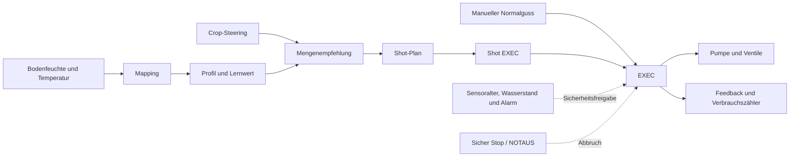

# Universelle selbstlernende Bewässerungssteuerung für Home Assistant

[Deutsch](README.md) · [English](README_EN.md)

**Universelle selbstlernende Bewässerungssteuerung für Home Assistant** steuert eine gemeinsame Pumpe und bis zu vier Pflanzenventile, berechnet den Gießbedarf aus Bodenfeuchte und Bodentemperatur, teilt größere Güsse in einzelne Shots auf und verbessert ihre Mengenempfehlung aus dem gemessenen Feuchteanstieg.

> [!NOTE]
> Die vorhandenen Dateinamen und Home-Assistant-Entitäts-IDs behalten aus Kompatibilitätsgründen den technischen Präfix `plantinator_bewasserung_`. Der öffentliche Projektname und der GitHub-Repositoryname verwenden „Plantinator“ nicht.

Zum Projekt gehören außerdem:

- manuelle und automatische Bewässerung,
- universelles Crop-Steering mit frei gemappten Quellen und Stage-Namen,
- optionale Tankumwälzung,
- ein beaufsichtigter Mess-Drain-Modus,
- Tages-, Wochen-, Monats- und Gesamtzähler,
- Sensoralter-, Wasserstands- und Alarmüberwachung,
- ein sicherer Stopp bei Fehlern und nach einem Home-Assistant-Neustart,
- ein umfangreiches Lovelace-Dashboard,
- ein optionaler Debug-Logger.

> [!CAUTION]
> Diese Konfiguration schaltet reale Pumpen und Ventile. Ein falsches Mapping, eine falsche Pumpenleistung oder ein ungeeigneter Grenzwert kann Pflanzen, Elektrik und Gebäude beschädigen. Verwende eine physische Überlaufbegrenzung, geeignete Netzteile, Sicherungen und wasserfeste Installation. Teste zunächst mit sehr kleinen Mengen in ein Messgefäß und lasse die Anlage dabei nicht unbeaufsichtigt. Das Projekt ersetzt keine zertifizierte Wasser- oder Elektrosicherung.

> [!IMPORTANT]
> Diese Bewässerungssteuerung wurde bisher ausschließlich mit
> **TRUEBNER-SMT100-Bodenfeuchtesensoren** praktisch getestet. Andere
> Bodenfeuchtesensoren können technisch über das Mapping angebunden werden,
> ihre Messwerte, Skalierung, Filterung und Reaktionszeit wurden mit diesem
> Projekt jedoch nicht validiert. Verwende die mitgelieferten Feuchte-,
> Dryback- und Lernwerte daher nicht ungeprüft mit einem anderen Sensortyp.
> Kalibriere zunächst jeden Sensor im verwendeten Substrat und teste die
> Automatik mit kleinen Wassermengen unter Aufsicht.

## Inhaltsverzeichnis

- [Funktionsweise](#funktionsweise)
- [Screenshots](#screenshots)
- [Voraussetzungen](#voraussetzungen)
- [Dateien im Projekt](#dateien-im-projekt)
- [Installation](#installation)
- [Ersteinrichtung in sicherer Reihenfolge](#ersteinrichtung-in-sicherer-reihenfolge)
- [Standardwerte und Kalibrierung](#standardwerte-und-kalibrierung)
- [Inbetriebnahme](#inbetriebnahme)
- [Bedienung](#bedienung)
- [Automatik im Detail](#automatik-im-detail)
- [Lernfunktion](#lernfunktion)
- [Monitoring und Alarmverriegelung](#monitoring-und-alarmverriegelung)
- [Vollständige Sicherheitslogik](SAFETY.md)
- [Wartung und Updates](#wartung-und-updates)
- [Fehlersuche](#fehlersuche)
- [Bekannte Grenzen](#bekannte-grenzen)
- [Veröffentlichung auf GitHub](#veröffentlichung-auf-github)

## Funktionsweise



Die abgegebene Wassermenge wird zeitbasiert berechnet:

```text
Pumpenlaufzeit in Sekunden = gewünschte Menge in ml / Pumpenleistung in ml/s
```

Ein Durchflussmesser ist nicht erforderlich, aber die Pumpenleistung muss sorgfältig kalibriert werden. Vor dem Einschalten wird zuerst der sichere `off`-Zustand der Pumpe bestätigt. Der anschließende Wechsel auf `on` bestätigt dadurch eindeutig den aktuellen Start, ohne vom zusätzlichen Home-Assistant-Zeitstempel `last_updated` abhängig zu sein. Die Pumpenlaufzeit beginnt direkt mit dem Einschaltbefehl und wird nicht durch eine verspätete Zustandsanzeige verlängert. Innerhalb dieser Laufzeit muss die Pumpe `on` melden; andernfalls wird sie ausgeschaltet, es werden 0 ml verbucht und alle Starts werden vorübergehend gesperrt. Beim Öffnen eines Ventils stehen zwei getrennte Schaltversuche zur Verfügung. Jeder `on`- und `off`-Befehl erhält seine eigene einstellbare Aktor-Bestätigungszeit; zwischen den Öffnungsversuchen liegt eine ebenfalls einstellbare Pause. Es kann jedoch keine verstopfte Leitung, gelöste Schlauchverbindung oder tatsächlich geflossene Wassermenge erkennen. Die genaue Reihenfolge steht in der [Sicherheitslogik](SAFETY.md#aktorbestätigung-bei-wlan-schaltern).

## Screenshots

Die Bilder zeigen die wichtigsten Bereiche des mitgelieferten Home-Assistant-Dashboards. Klicke auf ein Bild, um es in voller Größe zu öffnen. Die universelle Crop-Steering-Seite enthält Quellen-Mapping, Stage-Aliase sowie editierbare Phasenrezepte für Zeitfenster, Dryback und Shot-Größe.

### Übersicht

[](docs/images/overview.png)

| Automatik | EXEC und manuelle Bewässerung |
|---|---|
| [](docs/images/automation.png) | [](docs/images/exec.png) |

| Tankumwälzung | Shot-Plan |
|---|---|
| [](docs/images/circulation.png) | [](docs/images/shot-plan.png) |

| Selbstlernendes Feedback | Bewässerungsprofil |
|---|---|
| [](docs/images/self-learning-feedback.png) | [](docs/images/profile.png) |

| Hardware- und Sensormapping | Universelles Crop Steering |
|---|---|
| [](docs/images/mapping.png) | [](docs/images/crop-steering.png) |

| Monitoring und Dryback | Mess-Drain |
|---|---|
| [](docs/images/monitoring.png) | [](docs/images/mess-drain.png) |

### Debug und Live-Diagnose

[](docs/images/debug.png)

## Voraussetzungen

### Software

- eine aktuelle Home-Assistant-Installation,
- Zugriff auf `/config`,
- aktivierte YAML-Packages,
- ein YAML-Lovelace-Dashboard,
- keine Custom Cards; das Dashboard verwendet Home-Assistant-Kernkarten.

### Erforderliche Hardware-Entitäten

| Funktion | Erwartete Entität | Hinweise |
|---|---|---|
| Gemeinsame Pumpe | `switch.*` | Muss ihren tatsächlichen Ein-/Aus-Zustand zuverlässig melden |
| Ventil je aktiver Pflanze | `switch.*` | Ein eigenes Ventil für P1 bis P4 |
| Bodenfeuchte je aktiver Pflanze | numerischer `sensor.*` | Erwarteter Bereich 0 bis 100 % |
| Bodentemperatur je aktiver Pflanze | numerischer `sensor.*` | Wert in °C |

### Optionale Entitäten

| Funktion | Erwartete Entität |
|---|---|
| Hauptventil | `switch.*` |
| Wasserstand | `binary_sensor.*` oder `input_boolean.*` |
| Tankumwälzung | `switch.*` |
| Zulauf EC, pH und Temperatur | jeweils numerischer `sensor.*` |
| Lufttemperatur und Luftfeuchtigkeit | jeweils numerischer `sensor.*` |
| PPFD | numerischer `sensor.*` |

Crop-Steering funktioniert wahlweise vollständig manuell oder mit jeder externen Software, deren Werte in Home Assistant als Zustand oder Attribut einer Entität verfügbar sind:

| Crop-Quelle | Erwarteter Wert |
|---|---|
| Pflanzenphase | beliebiger kurzer Text, beispielsweise `Stretch`, `Flower Week 4` oder `Blüte 2` |
| Licht an | Uhrzeit als `HH:MM` oder `HH:MM:SS` |
| Licht aus | Uhrzeit als `HH:MM` oder `HH:MM:SS` |

Die Domain der Quell-Entität ist nicht festgelegt. Möglich sind unter anderem `sensor.*`, `select.*`, `input_select.*`, `text.*`, `time.*` und `input_datetime.*`. Liegt der benötigte Wert in einem Attribut, kann dessen Name separat gemappt werden. Ohne externe Quelle verwendet das System die manuellen Stage- und Lichtzeit-Helper.

## Dateien im Projekt

| Datei | Aufgabe |
|---|---|
| [`plantinator_bewasserung_mapping.yaml`](plantinator_bewasserung_mapping.yaml) | Zuordnung der realen Hardware und Pflanzensensoren |
| [`plantinator_bewasserung_profil.yaml`](plantinator_bewasserung_profil.yaml) | Pumpenleistung, Feuchte-, Temperatur- und Mengenlimits |
| [`plantinator_bewasserung_lernsensorik.yaml`](plantinator_bewasserung_lernsensorik.yaml) | Zustandsbewertung und Mengenempfehlung |
| [`plantinator_bewasserung_crop_steering.yaml`](plantinator_bewasserung_crop_steering.yaml) | Universelles Quellen-Mapping, Stage-Aliase, Lichtzeiten und Crop-Parameter |
| [`plantinator_shot_plan.yaml`](plantinator_shot_plan.yaml) | Aufteilung einer Empfehlung in einzelne Shots |
| [`plantinator_bewasserung_exec.yaml`](plantinator_bewasserung_exec.yaml) | Sichere Pumpen- und Ventilsequenz |
| [`plantinator_bewasserung_shot_exec.yaml`](plantinator_bewasserung_shot_exec.yaml) | Ausführung kompletter Shot-Pläne |
| [`plantinator_bewasserung_auto_controller.yaml`](plantinator_bewasserung_auto_controller.yaml) | Pflanzenauswahl, Pausen und automatische Starts |
| [`plantinator_bewasserung_guss_feedback.yaml`](plantinator_bewasserung_guss_feedback.yaml) | Lernen aus Feuchteanstieg und abgegebener Menge |
| [`plantinator_bewasserung_tank_umwalzung_v1.yaml`](plantinator_bewasserung_tank_umwalzung_v1.yaml) | Manuelle, zyklische und Pre-Guss-Umwälzung |
| [`plantinator_mess_drain.yaml`](plantinator_mess_drain.yaml) | Beaufsichtigter Pulsbetrieb bis Drain erkannt wird |
| [`plantinator_bewasserung_monitoring.yaml`](plantinator_bewasserung_monitoring.yaml) | Sensoralter, Umweltwerte, Dryback und Alarmverriegelung |
| [`plantinator_bewasserung_startup_safety.yaml`](plantinator_bewasserung_startup_safety.yaml) | Sicherer Zustand nach Home-Assistant-Start |
| [`plantinator_bewasserung_debug_logger.yaml`](plantinator_bewasserung_debug_logger.yaml) | Optionaler Diagnose-Logger |
| [`dashboard.yaml`](dashboard.yaml) | Vollständiges deutsches Lovelace-Dashboard |
| [`dashboard_en.yaml`](dashboard_en.yaml) | Vollständiges englisches Lovelace-Dashboard mit identischer Logik |
| [`SAFETY.md`](SAFETY.md) | Fehlerklassen, Aktorbestätigung, Verriegelung und Wiederfreigabe |
| [`SAFETY_EN.md`](SAFETY_EN.md) | Englische Sicherheitsdokumentation |

Alle `plantinator*.yaml`-Dateien sind voneinander abhängig und sollten gemeinsam installiert werden. Die beiden Dashboard-Dateien sind keine Package-Dateien und dürfen nicht in den Package-Ordner kopiert werden.

## Installation

### 1. Backup erstellen

Erstelle vor der Installation ein vollständiges Home-Assistant-Backup. Die Home-Assistant-Dokumentation beschreibt Backups unter [Common tasks – Backups](https://www.home-assistant.io/common-tasks/general/).

### 2. Package-Dateien kopieren

Lege beispielsweise diesen Ordner an:

```text
/config/packages/universal_irrigation/
```

Kopiere alle Dateien, deren Name mit `plantinator` beginnt und auf `.yaml` endet, in diesen Ordner. Die Verzeichnisstruktur kann anschließend so aussehen:

```text
/config/
├── configuration.yaml
├── dashboard.yaml
└── packages/
    └── universal_irrigation/
        ├── plantinator_bewasserung_auto_controller.yaml
        ├── plantinator_bewasserung_debug_logger.yaml
        ├── plantinator_bewasserung_exec.yaml
        ├── plantinator_bewasserung_guss_feedback.yaml
        ├── plantinator_bewasserung_lernsensorik.yaml
        ├── plantinator_bewasserung_mapping.yaml
        ├── plantinator_bewasserung_monitoring.yaml
        ├── plantinator_bewasserung_crop_steering.yaml
        ├── plantinator_bewasserung_profil.yaml
        ├── plantinator_bewasserung_shot_exec.yaml
        ├── plantinator_bewasserung_startup_safety.yaml
        ├── plantinator_bewasserung_tank_umwalzung_v1.yaml
        ├── plantinator_mess_drain.yaml
        └── plantinator_shot_plan.yaml
```

Aktiviere Packages in `configuration.yaml`:

```yaml
homeassistant:
  packages: !include_dir_named packages
```

Existiert bereits ein `homeassistant:`-Block, ergänze darin nur die Zeile `packages:`. Lege keinen zweiten `homeassistant:`-Block an. Weitere Informationen stehen in der offiziellen Dokumentation zu [Home-Assistant-Packages](https://www.home-assistant.io/docs/configuration/packages/).

### 3. Dashboard installieren

Wähle die gewünschte Sprache:

- `dashboard.yaml` für Deutsch
- `dashboard_en.yaml` für Englisch

Kopiere die gewählte Datei direkt nach `/config`. Das folgende Beispiel
verwendet das deutsche Dashboard:

Ergänze `configuration.yaml`:

```yaml
lovelace:
  dashboards:
    universal-irrigation:
      mode: yaml
      filename: dashboard.yaml
      title: Universelle selbstlernende Bewässerungssteuerung für Home Assistant
      icon: mdi:water-pump
      show_in_sidebar: true
      require_admin: true
```

Der Schlüssel `universal-irrigation` muss einen Bindestrich enthalten. `require_admin: true` ist für ein Dashboard, das reale Aktoren schaltet, ausdrücklich empfohlen. Details enthält die Home-Assistant-Dokumentation zu [mehreren YAML-Dashboards](https://www.home-assistant.io/dashboards/dashboards/).

Für das englische Dashboard verwendest du `dashboard_en.yaml` und einen
eigenen Dashboard-Schlüssel:

```yaml
lovelace:
  dashboards:
    universal-irrigation-en:
      mode: yaml
      filename: dashboard_en.yaml
      title: Universal Self-Learning Irrigation for Home Assistant
      icon: mdi:water-pump
      show_in_sidebar: true
      require_admin: true
```

Du kannst auch beide Blöcke mit unterschiedlichen Schlüsseln eintragen. Beide
Dashboards greifen auf dieselben Entitäten zu; ändere daher Parameter immer
nur bewusst, unabhängig davon, in welcher Sprachansicht du sie bearbeitest.

### 4. Optionalen Debug-Logger vorbereiten

Dieser Schritt ist nur nötig, wenn der Debug-Logger Dateien schreiben soll. Bleibt der Schalter **Debug Logger aktiv** aus, kann dieser Abschnitt übersprungen werden.

Ergänze den vorhandenen `homeassistant:`-Block:

```yaml
homeassistant:
  packages: !include_dir_named packages
  allowlist_external_dirs:
    - /config/plantinator_diag
```

Lege den Ordner an:

```text
/config/plantinator_diag
```

Füge anschließend in Home Assistant die Integration **File** hinzu:

1. Öffne **Einstellungen → Geräte & Dienste → Integration hinzufügen**.
2. Wähle **File**.
3. Verwende als Dateipfad `/config/plantinator_diag/plantinator_v3_snapshot.txt`.
4. Benenne die erzeugte Notify-Entität in `notify.plantinator_status` um.

Der Logger verwendet `notify.send_message` und erwartet exakt diese Entitäts-ID. Die offizielle Einrichtung ist unter [File integration](https://www.home-assistant.io/integrations/file/) beschrieben.

### 5. Konfiguration prüfen und neu starten

1. Öffne **Entwicklerwerkzeuge → YAML**.
2. Führe die Konfigurationsprüfung aus.
3. Behebe jeden gemeldeten Fehler.
4. Starte Home Assistant vollständig neu.

Viele Package-Bestandteile sind Helper, Skripte und Automationen. Ein vollständiger Neustart ist bei der Erstinstallation zuverlässiger als ein teilweises Neuladen. Die YAML-Werkzeuge sind in den [Home-Assistant-Entwicklerwerkzeugen](https://www.home-assistant.io/docs/tools/dev-tools/) beschrieben.

## Ersteinrichtung in sicherer Reihenfolge

### 1. Anlage zunächst sperren

Prüfe direkt nach dem Neustart auf der Seite **Übersicht**:

- **Hauptschalter:** aus
- **Automatik:** aus
- **Auto Controller:** aus
- **Sperre:** ein
- **EXEC läuft:** aus
- **Shot EXEC läuft:** aus
- **Umwälzung läuft:** aus

Nach einem Home-Assistant-Start wartet die Startup-Safety 20 Sekunden und schaltet danach Pumpe, Umwälzung und alle gemappten Ventile aus. Ein unterbrochener Guss wird bewusst nicht fortgesetzt. Sind alle drei Automatikschalter weiterhin aktiv, erfolgt erst nach zwei Minuten ein neuer Auto-Check.

### 2. Hardware-Mapping eintragen

Öffne **Mapping**.

#### Zentrale Zuordnung

- **Pumpe Entity:** `switch.*` der gemeinsamen Wasserpumpe
- **Hauptventil Entity optional:** leer lassen oder ein `switch.*` eintragen
- **Wasserstand Entity:** optionaler `binary_sensor.*` oder `input_boolean.*`
- **Wasserstand sicher bei:** `on` oder `off`, passend zur realen Sensorlogik
- **Tank-Umwälzung Entity:** optionaler `switch.*`
- **Wasserstand verwenden:** nur einschalten, wenn Entität und sicherer Zustand geprüft sind
- **Tank-Umwälzung verwenden:** nur bei tatsächlich vorhandener Umwälzpumpe einschalten

#### Zuordnung je Pflanze

Für P1 bis P4:

- **Aktiv:** nur für vorhandene Pflanzen einschalten
- **Name:** frei wählbare Bezeichnung
- **Ventil Entity:** `switch.*`
- **Bodenfeuchte Entity:** numerischer `sensor.*`
- **Bodentemperatur Entity:** numerischer `sensor.*`

Stelle **Anzahl Pflanzen** im Hauptmapping passend zur Installation auf 1 bis
4. Nur aktive Pflanzen innerhalb dieser Anzahl werden von Sensoralter und
Automatik berücksichtigt.

#### Beobachtungssensoren

Zulauf-, Klima- und PPFD-Sensoren sind optional. Sie werden für Monitoring und
die diagnostischen Umweltfaktoren verwendet. Die selbstlernende
Bewässerungsmenge wird davon nicht verändert. Nicht konfigurierte
Beobachtungssensoren blockieren die Kernbewässerung nicht.

Das Skript **Sichere Mapping-Grundwerte setzen** setzt vier Pflanzen, neutrale
Pflanzennamen und schaltet die optionalen Funktionen Wasserstand und
Tank-Umwälzung aus. Es schreibt bewusst keine Pumpen-, Ventil- oder Sensor-ID.
Diese Entity-IDs müssen immer zur tatsächlichen Installation passend manuell
eingetragen werden.

Der **Mapping Status** muss anschließend `ok` anzeigen.

### 3. Grundwerte initialisieren

Die YAML-Helper besitzen bewusst keine fest erzwungenen `initial:`-Werte, damit deine Einstellungen Neustarts überleben. Bei einer Neuinstallation solltest du die Grundwerte einmal setzen, während Hauptschalter aus und Sperre ein sind.

Führe über die jeweiligen Dashboard-Seiten diese Skripte aus:

1. **Profil Standardwerte setzen**
2. **Lernsensorik Standardwerte setzen**
3. **Shot Plan Standardwerte setzen**
4. **EXEC Standardwerte setzen**
5. **Feedback Standardwerte setzen**
6. **Auto Standardwerte setzen**
7. **Monitoring Standardwerte setzen**
8. **Umwälzung Standardwerte setzen**, falls das Modul verwendet wird
9. **Crop-Standardwerte setzen**
10. **Debug-Standardwerte setzen**, falls der optionale Logger verwendet wird

Das Auto-Skript schaltet den Auto Controller aus und setzt die Tageszähler zurück. Das Feedback-Skript verwirft vorhandene Lernwert-Gültigkeiten. Verwende diese Standardskripte später deshalb nicht unbedacht auf einer bereits eingelernten Anlage.

Die Debug-Standardwerte schalten den Logger aus und setzen sein Intervall auf
60 Sekunden.

**Sichere Mapping-Grundwerte setzen** ist optional. Passe danach
**Anzahl Pflanzen** und die Aktiv-Schalter an und trage sämtliche Entity-IDs
manuell ein.

### 4. Profil einrichten

Öffne **Profil** und stelle ein:

- reale Pumpenleistung in ml/s,
- Bodenfeuchte Minimum, Ziel und Maximum,
- maximale Menge pro Normalguss,
- maximale Tagesmenge je Pflanze,
- zulässige Bodentemperatur,
- Mess-Drain-Limits.

Gültig ist nur:

```text
Bodenfeuchte Minimum < Bodenfeuchte Ziel < Bodenfeuchte Maximum
Bodentemperatur Minimum < Bodentemperatur Maximum
Pumpenleistung > 0
```

Der **Profil Status** muss `ok` anzeigen.

### 5. Sensoren prüfen

Prüfe unter **Mapping**, **Übersicht** und **Monitoring**:

- alle aktiven Bodenfeuchten sind numerisch und plausibel,
- alle aktiven Bodentemperaturen sind numerisch und plausibel,
- die Sensorwerte aktualisieren sich,
- **Sensoralter Status** ist `ok`,
- **Kritischer Systemstatus** ist `ok`,
- **Alarm Status** ist `bereit`.

Der Standardwert für das maximal erlaubte Sensoralter ist 30 Minuten.

### 6. Crop-Steering einrichten

Öffne **Crop Steering** und führe zuerst **Crop-Standardwerte setzen** aus. Dadurch werden konservative Phasenrezepte, übliche Stage-Aliase, ein Substratvolumen von 10 Litern und manuelle Lichtzeiten von 06:00 bis 18:00 eingetragen. Anschließend können alle Rezeptwerte im Dashboard verändert werden.

Für die Anbindung einer externen Software:

1. Trage unter **Universelle Crop-Quellen** die Entity-ID für die Pflanzenphase ein.
2. Trage optional den Attributnamen ein, falls die Phase nicht der Zustand der Entität ist.
3. Wiederhole das für **Licht an** und **Licht aus**.
4. Lies den angezeigten **Stage Rohwert** ab.
5. Ergänze diesen Namen unter **Stage-Aliase** bei genau einer internen Phase.
6. Prüfe, dass **Quellen Status** `ok` und **Einstellungen Status** `ok` anzeigt.
7. Trage unter **Crop-Steering Einstellungen** das tatsächliche Substratvolumen ein.
8. Prüfe aktive Rezeptur, Gießschwelle, Shot-Größe, Crop Tagesphase und Normalguss Erlaubnis.

Ohne externe Software lässt du die drei Entity-Felder leer und stellst Stage sowie Lichtzeiten unter **Manueller Fallback** ein. Der Quellenstatus zeigt dann `manuell`; das ist ein gültiger Betriebszustand.

#### Unterschiedliche Stage-Namen zuordnen

Intern verwendet die Bewässerung immer dieselben acht Phasen:

```text
keimung
steckling
early_veg
mid_veg
late_veg
early_flower
mid_flower
late_flower
```

Die externe Bezeichnung wird nicht geraten, sondern über kommagetrennte Aliaslisten eindeutig übersetzt. Beispiele:

| Externer Rohwert | Eintrag in Aliasliste | Interne Phase |
|---|---|---|
| `Seedling` | Keimung | `keimung` |
| `Vegetation Week 2` | Mid Veg | `mid_veg` |
| `Stretch` | Early Flower | `early_flower` |
| `Flower Week 4` | Mid Flower | `mid_flower` |
| `Ripening` | Late Flower | `late_flower` |

Groß-/Kleinschreibung wird ignoriert. Leerzeichen, Bindestriche und Schrägstriche werden wie Unterstriche behandelt. `Flower Week 4`, `flower-week-4` und `flower_week_4` gelten daher als derselbe Name. Ein Alias darf nur in einer Liste vorkommen. Bei einem unbekannten oder mehrdeutigen Namen wird die interne Stage `unbekannt`; die Automatik wechselt sicher auf `nur_manuell`.

## Standardwerte und Kalibrierung

Die Schaltflächen **Standardwerte setzen** schreiben die folgenden Startwerte. Sie sind Beispiele und keine universelle Empfehlung.

### Grundprofil

| Parameter | Standardwert |
|---|---:|
| Pumpenleistung | 50 ml/s |
| Bodenfeuchte Minimum | 32 % |
| Bodenfeuchte Ziel | 42 % |
| Bodenfeuchte Maximum | 55 % |
| Maximalmenge pro Normalguss | 500 ml |
| Tageslimit je Pflanze | 1200 ml |
| Maximalmenge Mess-Drain | 1200 ml |
| Mess-Drain-Puls | 200 ml |
| Mess-Drain-Pulspause | 180 s |
| Bodentemperatur Minimum | 17 °C |
| Bodentemperatur Maximum | 26 °C |

### Lernsensorik und Feedback

| Parameter | Standardwert |
|---|---:|
| Startwert | 35 ml/% |
| Kleinster empfohlener Guss | 50 ml |
| Notguss-Schwelle unter Minimum | 5 Prozentpunkte |
| Feedback-Wartezeit | 10 min |
| Lernrate | 30 % |
| Mindest-Feuchteanstieg | 2 % |
| Untergrenze Lernwert | 20 ml/% |
| Obergrenze Lernwert | 250 ml/% |
| Ausreißerprüfung ab | 3 akzeptierten Lernvorgängen |
| Maximale Ausreißer-Abweichung | 50 % vom bisherigen Lernwert |
| Maximale Lernwertänderung je Vorgang | 20 % |
| Volles Lernvertrauen ab | 5 akzeptierten Lernvorgängen |
| Diagnosegrenze Peak-Abfall | 3 Feuchte-Prozentpunkte |
| Wetback-Peak-Toleranz | ±0,5 Feuchte-Prozentpunkte |
| Maximaler Wetback-Nachguss | 800 ml |

> [!IMPORTANT]
> Verwende bei einem Update mit bereits angelernten Pflanzen im Dashboard
> **Neue Schutzwerte setzen (Lernwerte behalten)**. Dieser Button setzt nur
> Feedback-Wartezeit, Ausreißerschutz, Änderungsgrenze, Vertrauensziel und
> Peak-Diagnose sowie das Wetback-Peak-Fenster und die maximale
> Nachgussmenge. **Neuer Topf / Substrat – Lernbasis auf Standard** ist für
> einen Wechsel von Topf, Topfgröße, Substrat oder einer ähnlich grundlegenden
> Änderung vorgesehen. Er setzt die Lern- und Feedbackparameter auf die oben
> genannten Standardwerte, verwirft Lernwerte, Gültigkeitsflags, Zähler,
> Historien sowie alte Vor-/Nachguss- und Peak-Diagnosedaten und initialisiert
> die Crop-Peaks wieder mit dem eingestellten Bodenfeuchte-Ziel. Auch die
> Ramp-up-Abschlüsse werden für alle Pflanzen zurückgesetzt. Mapping,
> Pumpenkalibrierung, Sicherheitsgrenzen, Crop-Rezepte und Verbrauchszähler
> bleiben erhalten.

### Shot-Plan

| Parameter | Standardwert |
|---|---:|
| Shot Minimum | 50 ml |
| Shot Maximum | 200 ml |
| Mindest-Restmenge | 100 ml |
| Pause Normalguss | 180 s |
| Pause Notguss | 90 s |
| Maximale Shot-Anzahl | 10 |

### Crop-Steering-Phasenrezepte

Die folgenden Werte sind konservative Ausgangspunkte für sensorgestützte Bewässerung in Coco oder Steinwolle. Sie sind keine universelle Garantie. Topfgröße, Substrat, Tropfer, Klima, Sensorposition und Genetik müssen bei der Kalibrierung berücksichtigt werden.

| Interne Phase | Start nach Licht an | Stop vor Licht aus | Overnight-/Ramp-up-Dryback | Maintenance-Dryback | Shot vom Substratvolumen |
|---|---:|---:|---:|---:|---:|
| `keimung` | 0 min | 120 min | 5 % | 2,0 % | 1,0 % |
| `steckling` | 0 min | 120 min | 5 % | 2,0 % | 1,5 % |
| `early_veg` | 30 min | 60 min | 8 % | 2,5 % | 2,0 % |
| `mid_veg` | 45 min | 90 min | 8 % | 3,0 % | 3,0 % |
| `late_veg` | 90 min | 150 min | 12 % | 3,5 % | 3,5 % |
| `early_flower` | 150 min | 210 min | 18 % | 4,0 % | 5,0 % |
| `mid_flower` | 90 min | 150 min | 12 % | 3,0 % | 3,5 % |
| `late_flower` | 120 min | 180 min | 18 % | 4,0 % | 4,0 % |

Weitere Crop-Standardwerte:

| Parameter | Standardwert |
|---|---:|
| Substratprofil | `coco` |
| Substratvolumen | 10 l |
| Ramp-up Shot-Faktor | 60 % |
| Zulässiges Peak-Fenster | Referenz ±0,5 Prozentpunkte |
| Maximaler einmaliger Nachguss | 800 ml |

`ramp_up` besitzt keine feste Zeitdauer mehr. Jede Pflanze wartet nach ihrer
frühesten Startzeit auf `gespeicherter Peak − Ramp-up-Dryback`. Danach wird
der gesamte berechnete Wasserverlust als vollständige Sequenz ausgeführt.
Der Ramp-up-Faktor verkleinert dabei nur die einzelnen Shots: Aus einem
Basis-Shot von 300 ml werden bei 60 % beispielsweise 180 ml. Das globale
Shot-Minimum bleibt als Untergrenze aktiv. Nach erfolgreicher Sequenz und
Feedback wechselt nur diese Pflanze zu `maintenance`; dort gelten normale
Shots und der phasenspezifische Maintenance-Dryback. Der Button
**Nur Maintenance-Startwerte setzen** schreibt ausschließlich die acht
Maintenance-Werte aus der Tabelle und lässt alle übrigen Einstellungen
unverändert.

„Vollständige Sequenz“ hebt keine Sicherheitsgrenze auf: Der Maximalguss
begrenzt weiterhin die berechnete Empfehlung. Reicht die konfigurierte
maximale Shot-Anzahl für die vollständige Liste nicht aus, blockiert Shot-EXEC
den Start und meldet `blockiert_zu_viele_shots`.

Die Aufteilung in Ramp-up, Maintenance und nächtlichen Dryback entspricht der
in einer kontrollierten Cannabis-Studie beschriebenen Präzisionsbewässerung.
Dort wurden in der Maintenance-Phase die VWC-Zielbereiche gehalten und in der
Bulking-Phase häufiger bewässert. Deshalb ist der Maintenance-Dryback für
`mid_flower` enger als für `early_flower` und `late_flower`. Eine weitere
kontrollierte Studie zeigt, dass Wasserstress in der Blüte die
Infloreszenzmasse verringern kann. Die Werte 2,0–4,0 sind daher bewusst milde
**technische Startwerte**, keine wissenschaftlich validierten Grenzwerte für
den SMT100.

Die Prozentwerte verschiedener Sensoren und Substrate sind nicht direkt
vergleichbar. Die Studie arbeitete mit Steinwolle und anderen
Substratsensoren; das vorliegende Projekt wurde praktisch nur mit dem
TRUEBNER SMT100 getestet. Ein Maintenance-Dryback von 3 % bedeutet hier:
Der gemappte Messwert darf vom zuletzt gespeicherten Peak um 3
**Prozentpunkte** fallen.

- [Karnoutsos et al. 2026 – dreiphasige Präzisionsbewässerung bei medizinischem Cannabis](https://www.mdpi.com/2311-7524/12/5/619)
- [Water Stress Effects on Biomass Allocation and Secondary Metabolism in Cannabis sativa](https://www.mdpi.com/2223-7747/14/8/1267)
- [Grodan – Precision Irrigation in Cannabis (PDF)](https://www.grodan.com/siteassets/downloads/downloads-na-101/grow-guide-2023/precision-irrigation.pdf)
- [AROYA – Drybacks 101](https://aroya.io/education-guides/drybacks-101)
- [Botanicare – Irrigation Strategies for Coco Pro and Rockwool](https://www.botanicare.com/hydro-101/irrigation-strategies-cocopro-rockwool/)

### EXEC, Automatik und Umwälzung

| Parameter | Standardwert |
|---|---:|
| Manueller Testguss | 100 ml |
| Ventil-Vorlauf | 1 s |
| Ventil-Nachlauf | 1 s |
| Maximale Aktor-Bestätigungszeit | 8 s |
| Auto-Check-Intervall | 5 min |
| Mindestpause je Pflanze | 45 min |
| Umwälzintervall | 180 min |
| Zyklische Umwälzdauer | 120 s |
| Pre-Guss-Umwälzdauer | 60 s |
| Mindestpause Pre-Guss | 30 min |

### Monitoring und Umweltdiagnose

| Parameter | Standardwert |
|---|---:|
| Maximales Sensoralter | 30 min |
| Klimaeinfluss | 0 % |
| Lichteinfluss | 0 % |
| Zulaufeinfluss | 0 % |
| Maximale Diagnosekorrektur | 10 % |
| VPD-Referenz | 1,2 kPa |
| PPFD-Referenz | 600 µmol/m²/s |
| DLI-Referenz | 35 mol/m² |
| Zulauf-EC-Referenz | 2,0 |
| Zulauf-pH-Referenz | 5,8 |
| Zulauftemperatur-Referenz | 20 °C |

Die drei Umwelteinflüsse beginnen bei 0 %. Die daraus berechneten Roh- und
Effektivfaktoren sind Diagnose- und Simulationswerte. Sie verändern die
selbstlernende Bewässerungsmenge nicht; diese wird ausschließlich aus
Peak-Verlust und ml/%-Lernwert bestimmt. Die Helfer bleiben aus
Kompatibilitätsgründen erhalten.

### Pumpenleistung kalibrieren

1. Führe den Pumpenausgang in einen Messbecher.
2. Sorge dafür, dass eine nicht selbstansaugende Pumpe gefüllt ist. Lass eine dafür ungeeignete Pumpe niemals trocken laufen.
3. Schalte die Pumpe für eine exakt gemessene Zeit ein.
4. Miss die geförderte Menge.
5. Berechne:

```text
Pumpenleistung = gemessene Menge / Laufzeit
```

Beispiel:

```text
500 ml / 10 s = 50 ml/s
```

Wiederhole die Messung mindestens dreimal unter realen Schlauch-, Höhen- und Druckbedingungen und verwende den Mittelwert. Prüfe die Kalibrierung regelmäßig, weil Filter, Leitungen und Pumpen altern.

## Inbetriebnahme

Führe diese Schritte in Anwesenheit und in der angegebenen Reihenfolge aus:

1. Hauptschalter aus, Automatik aus, Auto Controller aus, Sperre ein.
2. Prüfen, dass Pumpe und alle Ventile physisch aus beziehungsweise geschlossen sind.
3. Mapping, Sensorwerte, Wasserstand und Profil kontrollieren.
4. Auslass der ersten Pflanze in ein Messgefäß führen.
5. Sperre ausschalten und Hauptschalter einschalten.
6. Unter **EXEC → Manueller Normalguss** eine kleine, sichere Testmenge einstellen.
7. Nur P1 starten und die reale Schaltfolge beobachten:
   - Pumpe zunächst aus,
   - andere Ventile zu,
   - optionales Hauptventil auf,
   - Pflanzenventil auf,
   - Pumpe an,
   - Pumpe aus,
   - Nachlauf,
   - Ventile zu.
8. Abgegebene Menge nachmessen und Pumpenleistung korrigieren.
9. Den Test für jede aktive Pflanze wiederholen.
10. Während eines kleinen Tests **NOTAUS** beziehungsweise **Sicher Stop** prüfen.
11. Wasserstandssensor während eines beaufsichtigten Tests in den unsicheren Zustand bringen. Der Lauf muss stoppen und der Alarm verriegeln.
12. Ursache beheben und erst danach den Alarm quittieren.
13. Anlage mehrere Tage manuell beobachten.
14. Erst dann Automatik und Auto Controller einschalten.

Nach jedem Test müssen Pumpe, Hauptventil und Pflanzenventile wieder aus sein.

## Bedienung

### Übersicht

Die Übersicht ist die tägliche Betriebsseite.

#### Systemfreigaben

| Element | Wirkung |
|---|---|
| Hauptschalter | Globale Freigabe aller normalen Abläufe |
| Automatik | Erlaubt automatische Bewässerungsentscheidungen |
| Auto Controller | Führt die regelmäßigen Auto-Checks aus |
| Sperre | Blockiert Starts und löst bei Aktivierung einen sicheren Stopp aus |
| EXEC läuft | Kern-Pumpensequenz ist aktiv |
| Shot EXEC läuft | Ein kompletter Shot-Plan wird ausgeführt |
| Shot EXEC reserviert | Ein Shot-Lauf hat die Anlage reserviert, gegebenenfalls schon vor der Pre-Guss-Umwälzung |
| Umwälzung läuft | Der Tankaktor ist aktiv |
| Alarm quittieren | Entriegelt nur, wenn der kritische Systemstatus wieder `ok` ist |
| NOTAUS | Stoppt Pumpe, Umwälzung und Ventile und setzt Abbruchanforderungen |

#### Auto-Kurzstatus

**Shot-EXEC Wartezeit** zeigt den gemeinsamen Timer für:

- Pausen zwischen zwei Shots,
- die anschließende Feedback-Wartezeit.

Der Timer ist daher nicht ausschließlich die Restlaufzeit der Pumpe. Im Leerlauf ist er beendet beziehungsweise inaktiv.

Die Pflanzenübersicht zeigt Feuchte, Feuchtezustand, Gießbedarf, Auto-Freigabe, empfohlene Menge, heutigen Verbrauch und die berechnete Shot-Sequenz.

### Automatik

Für einen automatischen Start müssen gleichzeitig eingeschaltet sein:

- Hauptschalter,
- Automatik,
- Auto Controller.

Zusätzlich müssen Sperre und Alarm aus sein und alle Sicherheitsfreigaben passen. Der Auto Controller prüft im eingestellten Intervall und auch bei relevanten Zustandsänderungen.

Unter **Pflanzenfreigaben** ist der konkrete Ablehnungsgrund jeder Pflanze sichtbar. Der automatische Start verwendet die berechnete Empfehlung und führt sie über den Shot-Plan aus.

Die Tageszähler werden täglich um 00:05 Uhr zurückgesetzt. Wochen- und Monatsverbrauch werden über Utility Meter geführt.

### EXEC

#### Manueller Normalguss

Der manuelle Normalguss verwendet den Wert **Manueller Testguss ml**. Er verwendet nicht automatisch die berechnete Pflanzenempfehlung.

Im Bereich **Manuelle Aktionen** zeigt **Aktuelle Pumpen-Restzeit** die noch
verbleibende reine Pumpenlaufzeit des laufenden Einzelgusses. Direkt unter den
vier Starttasten stehen außerdem die Tagesmengen der Pflanzen. Ein erfolgreich
beendeter manueller Normalguss wird automatisch zur Tages- und Gesamtmenge der
betroffenen Pflanze addiert. Bei einem Abbruch nach Pumpenstart wird nur die aus
Pumpenlaufzeit und kalibrierter Förderrate berechnete Teilmenge verbucht; ein
Abbruch vor Pumpenstart verbucht nichts.

1. Gewünschte Menge einstellen.
2. Sicherheitsstatus kontrollieren.
3. Starttaste der Pflanze drücken.
4. Lauf beobachten.
5. Feedback-Wartezeit abwarten.

Auch ein manueller Guss benötigt eine gültige EXEC-Freigabe. Ein bereits ausstehendes Feedback der Pflanze kann einen weiteren Lauf blockieren.

Ein manueller Normalguss wird auf **Max ml pro Normalguss** begrenzt. Er durchläuft jedoch nicht die automatische Crop-, Mindestpausen- und Tageslimit-Freigabe. Prüfe diese Werte als Bediener selbst.

#### Shot-Plan manuell starten

Die vier Shot-Plan-Starttasten starten die aktuell berechnete Sequenz für die gewählte Pflanze. Vorher prüfen:

- Gießbedarf ist vorhanden,
- Empfehlung und Shot-Sequenz sind plausibel,
- heutiger Verbrauch plus Empfehlung überschreitet das Tageslimit nicht,
- Crop-Freigabe und aktuelle Tagesphase erlauben den Lauf,
- kein anderer Prozess reserviert die Anlage.

Der manuelle Shot-Start prüft Gießbedarf, Empfehlung, Shot-Grenzen, Pflanzensensoren und die allgemeinen Sicherheitsfreigaben. Er verwendet aber nicht die vollständige Auto-Freigabe mit Crop-Regel, Mindestpause und Tageslimit. Diese drei Punkte müssen bei einem manuellen Start vom Bediener geprüft werden.

Mit **Shot-Plan Stop** oder **Shot EXEC Sicher Stop** wird der Lauf abgebrochen.

#### Sicherheitsaktionen

- **Shot EXEC Sicher Stop:** beendet Shot-Timer und Shot-Ausführung.
- **Sicher Stop:** globaler sicherer Stopp.
- **Pumpe aus:** schaltet nur die gemappte Pumpe aus.
- **Alle Ventile zu:** schließt Haupt- und Pflanzenventile.

Im Zweifel immer **Sicher Stop** verwenden.

### Shot Plan

Die Seite zeigt für jede Pflanze:

- Gießbedarf und Empfehlung,
- Anzahl der Shots,
- Sequenz in ml,
- errechnete Pumpenlaufzeiten,
- geplante Gesamtmenge,
- Pause zwischen den Shots,
- gesamte Pumpenlaufzeit.

Größere Mengen werden anhand von **Shot Maximum** geteilt. Ist eine Restmenge
kleiner als **Shot Minimum Rest**, verteilt der Plan die Gesamtmenge möglichst
gleichmäßig auf alle Shots. Dadurch wird das harte Shot-Maximum niemals
überschritten. Der Executor verwendet exakt die angezeigte ml-Sequenz und
prüft nach jedem Shot den eindeutigen Erfolgsstatus. Sequenzen mit einem
technisch nicht ausführbaren Einzelshot unter 25 ml werden sicher blockiert.
Ein Notguss verwendet die kürzere Notguss-Pause.

### Feedback

Nach einem Normal- oder Shot-Guss:

1. wird die Bodenfeuchte vor dem Guss gespeichert,
2. bleibt **Feedback ausstehend** aktiv,
3. verfolgt das System automatisch den höchsten gemeldeten Feuchtewert,
4. wartet es die konfigurierte Feedback-Zeit,
5. liest es den dann stabilisierten Wert,
6. berechnet es Feuchteanstieg, Peak-Abfall und gegebenenfalls einen neuen
   Lernwert.

Während dieser Transaktion ist ein weiterer Guss derselben Pflanze blockiert. Ändere Feuchtesensor, Lernwerte oder Feedback-Flags nicht während eines laufenden Feedbacks.

### Umwälzung

Die Tankumwälzung ist optional und benötigt einen gemappten `switch.*`.

- **Umwälzung verwenden:** globale Hardwarefreigabe.
- **Zyklisch aktiv:** startet nach Ablauf des Intervalls einen zeitbegrenzten Lauf.
- **Pre-Guss aktiv:** führt vor einem Guss eine Umwälzung aus, wenn die Mindestpause überschritten ist.
- **Manuell starten/stoppen:** direkte Bedienung.
- **Sofort aus:** schaltet den Umwälzaktor aus.

Eine Bewässerung hat Vorrang. Beginnt ein EXEC- oder Shot-Lauf, wird die Umwälzung beendet beziehungsweise nicht gestartet.

### Mess-Drain

> [!WARNING]
> Mess-Drain kann mit den Standardwerten bis zu 1200 ml je Lauf abgeben. Dieser Modus muss durchgehend beaufsichtigt werden.

Der Modus dient dazu, Wasser in Pulsen zuzuführen, bis am Substrat Drain sichtbar wird.

1. Unter **Mess-Drain** den Modus `manuell` wählen.
2. Maximalmenge, Pulsmenge und Pulspause kontrollieren.
3. Messgefäß für den Drain bereitstellen.
4. Starttaste der Pflanze drücken.
5. Den Ablauf ständig beobachten.
6. Sobald Drain sichtbar ist, bei derselben Pflanze **Drain bestätigt / Stop** drücken.
7. Die Anzeige **Erfolgreich abgegeben** ablesen.
8. Drain-EC und Drain-pH bei Bedarf als Handwerte eintragen.
9. Drain-Modus anschließend wieder auf `aus` setzen.

Ohne Bestätigung endet der Lauf spätestens an der Maximalmenge. Die eingetragenen EC- und pH-Handwerte werden protokolliert, aber nicht automatisch zur Bewässerungsregelung verwendet.

### Profil und Mapping

Diese Seiten sind Konfigurationsseiten, keine tägliche Bedienung. Änderungen an Mapping, Pumpenleistung, Grenzen und Maximalmengen können sofort auf den nächsten Lauf wirken. Nimm solche Änderungen nur mit eingeschalteter Sperre und ausgeschalteter Automatik vor.

### Crop Steering

Für jede interne Phase gibt es ein vollständig editierbares Rezept:

- frühester Bewässerungsstart in Minuten nach Licht an,
- letzter Bewässerungszeitpunkt in Minuten vor Licht aus,
- gewünschter Overnight-/Ramp-up-Dryback als direkte Feuchtedifferenz,
- eigener Maintenance-Dryback als direkte Feuchtedifferenz,
- Shot-Größe als Prozent des Substratvolumens.

Der Schalter **Individuelle Parameter** bestimmt, ob die Dashboardwerte verwendet werden. Ist er aus oder meldet **Einstellungen Status** einen Fehler, werden die dokumentierten Standardwerte verwendet. Ein unbekannter oder nicht eindeutig gemappter Pflanzenstatus blockiert weiterhin die Automatik.

#### Dryback und Gießschwelle

Jede Pflanze verwendet ihren eigenen zuletzt erfolgreich gemessenen Peak.
Die Dryback-Zahl wird als direkte Differenz abgezogen und muss nicht relativ
umgerechnet werden:

```text
Ramp-up-Startwert =
  max(Bodenfeuchte Minimum, letzter Peak - Ramp-up-Dryback)

Maintenance-Startwert =
  max(Bodenfeuchte Minimum, letzter Peak - Maintenance-Dryback)
```

Beispiel: Ein gespeicherter Peak von 32 %, ein Dryback von 5 % und ein
Minimum von 19 % ergeben einen Startwert von 27 %; bei 27 % oder darunter
wird der Ramp-up freigegeben. Ein Dryback von 18 %
würde rechnerisch 14 % ergeben und wird deshalb auf das Sicherheitsminimum
von 19 % angehoben.

Der globale Wert **Bodenfeuchte Minimum** ist damit eine harte Untergrenze für das normale Crop-Steering. `kritisch_trocken` wird weiterhin erst unter **Minimum minus Notguss-Schwelle** ausgelöst. Das Dryback-Rezept darf diese Notfalllogik nicht absenken.

Solange noch kein erfolgreicher Peak gespeichert wurde, wird das konfigurierte
**Bodenfeuchte Ziel** als Startwert für die Rechnung verwendet.
Der Maintenance-Dryback darf nicht größer als der Overnight-Dryback der
aktiven Rezeptur sein; andernfalls meldet der Einstellungsstatus
`fehler_maintenance_groesser_overnight`.

> [!IMPORTANT]
> Die Prozentwerte kapazitiver Feuchtesensoren sind keine genormten Wassergehalte. Kalibriere Ziel, Minimum und Dryback anhand des tatsächlich verwendeten Sensors und Substrats. Verändere Dryback-Ziele schrittweise und beobachte mindestens mehrere vollständige Lichtzyklen.

#### Dynamische Shot-Größe

Die Zielgröße eines Shots wird so berechnet:

```text
Shot ml =
  Substratvolumen in Liter
  × 1000
  × Shot-Prozent
  / 100
```

Bei 10 Litern Substrat entsprechen 3 % beispielsweise 300 ml. Das Ergebnis wird zusätzlich durch **Shot Minimum** und **Shot Maximum** begrenzt. Die berechnete Gesamtmenge, der Maximalguss, die maximale Shot-Anzahl und das Tageslimit bleiben weitere Grenzen.

Das Feld **Substratprofil** kennzeichnet die verwendete Grundlage (`coco`, `steinwolle`, `erde` oder `benutzerdefiniert`). Es verändert keine Werte heimlich; die tatsächlichen Rezeptwerte bleiben im Dashboard sichtbar und einzeln editierbar.

#### Pflanzenphasen und vollständige Sequenzen

Die globale Tagesphase stellt nur das sichere Bewässerungsfenster bereit.
Innerhalb dieses Fensters arbeitet jede Pflanze unabhängig:

- `warte_licht`: früheste Startzeit noch nicht erreicht,
- `warte_dryback`: Startzeit erreicht, Dryback noch nicht erreicht,
- `ramp_up`: Dryback erreicht; vollständige Sequenz mit kleineren Shots,
- `maintenance`: Ramp-up und Feedback erfolgreich abgeschlossen,
- `overnight_dryback`: Stopzeit vor Licht aus erreicht,
- `nacht`: Licht aus.

Der Ramp-up gleicht den Wasserverlust bis zum gespeicherten Peak aus:

```text
Defizit = gespeicherter Peak - aktuelle Feuchte
Gesamtmenge = Defizit × gelernte ml pro Prozent
```

Der Shot-Plan teilt diese Gesamtmenge in kleinere Ramp-up-Shots und Shot-EXEC
führt die komplette Liste aus. Hauptsequenz, Peak-Prüfung und ein eventuell
nötiger Nachguss sind dabei **ein einziger Ramp-up-Vorgang**. Die automatische
Peak-Erfassung verwendet den höchsten gültigen SMT100-Wert seit Gussstart.
Er muss im einstellbaren Fenster liegen:

```text
untere Grenze = Referenz-Peak − Peak-Toleranz
obere Grenze  = Referenz-Peak + Peak-Toleranz
```

Liegt der erste gemessene Peak unter der unteren Grenze, berechnet das System
aus fehlenden Prozentpunkten und dem pflanzenspezifischen ml/%-Lernwert genau
einen Nachguss. Die tatsächlich ausgeführte Menge ist das Minimum aus der
berechneten Menge und der Menge, die durch Nachgussmaximum, Maximalguss,
Tageslimit, Shot-Maximum und verbleibende Shot-Anzahl noch zulässig ist. Werden
beispielsweise 867 ml berechnet und sind nur 800 ml erlaubt, gibt das System
800 ml ab, statt den Vorgang vorzeitig als Fehler zu beenden.

Nach einer zweiten Feedback-Wartezeit wird der Peak erneut geprüft. Ein zu
niedriger Peak erzeugt eine persistente Warnung und lässt Ramp-up offen, führt
aber **nicht** zur globalen Alarmverriegelung. Ein zu hoher Peak beendet den
Lauf sicher und verriegelt die Anlage. Während eines mehrteiligen Nachgusses
wird die Obergrenze auch vor jedem weiteren Shot geprüft. Ein ungültiger
Peak-Sensor beendet den Vorgang sicher mit Warnung, ohne die Anlage global zu
verriegeln. Ein echter technischer EXEC-Fehler bleibt ein kritischer Fehler.

Bei Erfolg bleibt der Referenz-Peak unverändert; Messwerte dürfen innerhalb
des Fensters fallen oder steigen, ohne die nächste Gießschwelle schleichend zu
verschieben. Erst dann wird `Ramp-up abgeschlossen` gesetzt. Bei Abbruch, Alarm
oder Hardwarefehler erfolgt dieser Übergang nicht. In Maintenance wird dieselbe
Verlustrechnung und Peak-Absicherung mit normalen Shots und dem kleineren
Maintenance-Dryback verwendet.

Beim nächsten Wechsel auf Licht an werden die Ramp-up-Abschlüsse aller
Pflanzen genau einmal je Lichttag zurückgesetzt. Ein gespeicherter
Lichttag-Schlüssel verhindert, dass ein Home-Assistant-Neustart während der
Lichtphase denselben Reset erneut ausführt. Kritische Notgüsse bleiben
abhängig von den übrigen Sicherheitsprüfungen möglich. Wenn Start plus Stop
mindestens so lang wie die Lichtdauer ist, meldet der Einstellungsstatus
`fehler_keine_bewaesserungszeit` und automatische Normalgüsse werden
blockiert.

### Monitoring

Die Monitoring-Seite enthält:

- Alarmzustand und letzten Alarmgrund,
- Alter der aktiven Pflanzensensoren,
- Klima-, Licht- und Zulaufsensorstatus,
- diagnostische Roh- und Effektivfaktoren,
- VPD, PPFD und DLI,
- Zulauf-EC, pH und Temperatur,
- 1-Stunden- und Nacht-Dryback,
- Verlaufsdiagramme.

Die Monitoring-Drybacks zeigen die gemessene Entwicklung. Ramp-up-Dryback und
Maintenance-Dryback steuern die jeweilige normale Gießschwelle; sie verändern
nicht die harte Notfallgrenze.

### Debug

Die Debug-Seite zeigt die Auto-Entscheidung, Freigaben, Flags und gemappten
Aktorzustände. Zusätzlich speichert sie die letzten 20 Warnungen und kritischen
Fehler dauerhaft mit Zeitpunkt, Stufe, Code und Details; der neueste Eintrag
steht oben. Die Liste beginnt nach dem ersten vollständigen Neustart mit dieser
Version und kann im Dashboard geleert werden. Reine Info-Ereignisse werden
nicht als Fehler gezählt. Mit eingerichtetem File-Logger können Testmeldungen,
einzelne Snapshots oder periodische Snapshots geschrieben werden.

Der periodische Logger ist standardmäßig aus. Beim Einschalten wird die bestehende Zieldatei geleert und anschließend neu beschrieben.

## Automatik im Detail

### Gießbedarf

Die Bodenfeuchte wird ungefähr so eingeordnet:

| Zustand | Bedingung |
|---|---|
| `kritisch_trocken` | Unter Sicherheitsminimum minus Notguss-Schwelle |
| `trocken` | Unter aktiver Crop-Gießschwelle |
| `unter_ziel` | Zwischen aktiver Crop-Gießschwelle und Ziel |
| `zielbereich` | Zwischen Ziel und Maximum |
| `zu_nass` | Über Maximum |
| Sensorfehler | Kein gültiger Zahlenwert zwischen 0 und 100 |

Ein kritischer Temperaturzustand blockiert einen normalen Guss. Bei kritisch trockener Pflanze kann die Notguss-Logik Vorrang erhalten.

### Mengenempfehlung

Vereinfacht gilt:

```text
Feuchtedefizit = max(0, gespeicherter Peak - aktuelle Bodenfeuchte)

Empfehlung =
  Feuchtedefizit
  × ml pro Prozent
```

Anschließend begrenzen Mindestguss und Maximalmenge pro Normalguss die Empfehlung. Das Tageslimit wird zusätzlich bei der automatischen Pflanzenfreigabe geprüft. Manuelle Starts umgehen diese Auto-Prüfung. Solange noch kein gültiger Lernwert vorhanden ist, wird der konfigurierte Startwert in ml/% verwendet.

### Pflanzenauswahl

Eine Pflanze ist nur automatisch freigegeben, wenn unter anderem:

- sie aktiv und innerhalb der Pflanzenanzahl liegt,
- ein Gießbedarf besteht,
- kein Feedback aussteht,
- Crop-Steering den Lauf erlaubt,
- die Mindestpause seit dem letzten Auto-Start abgelaufen ist,
- Empfehlung und Tageslimit den Lauf erlauben.

Die Auswahl erfolgt nach Dringlichkeit:

1. freigegebene Pflanzen mit Notgussbedarf zuerst,
2. danach die größte positive Differenz aus
   `individuelle Gießschwelle − aktuelle Feuchte`,
3. bei identischer Priorität die kleinere Pflanzennummer.

Damit berücksichtigt die Auswahl den pflanzenspezifischen Peak und die jeweils
gültige Ramp-up- oder Maintenance-Schwelle. Nach jedem Lauf wird die
Priorität mit den aktuellen Zuständen neu berechnet.

### Parallelität

Pumpe, Normalguss, Shot-Plan, Mess-Drain und Umwälzung sind gegenseitig verriegelt. Die Shot-Ausführung setzt bereits vor einer möglichen Pre-Guss-Umwälzung eine Reservierung, damit kein zweiter Ablauf dazwischen startet.

## Lernfunktion

Der gemessene Wert eines Gusses lautet:

```text
berechnete ml/% = abgegebene Menge / Feuchteanstieg
```

Gelernt wird nur, wenn:

- ein gültiges Feedback aussteht,
- die Bodenfeuchte vor und nach dem Guss gültig ist,
- die Menge größer als 0 ist,
- der Feuchteanstieg mindestens dem konfigurierten Mindestanstieg entspricht,
- der berechnete Wert innerhalb der harten Min-/Max-Grenzen liegt,
- der Messwert nach der Anlernphase nicht stärker als erlaubt vom bisherigen
  Lernwert abweicht.

Nach standardmäßig drei akzeptierten Lernvorgängen gilt ein neuer Messwert als
Ausreißer, wenn er mehr als 50 % vom bisherigen Lernwert abweicht. Ein
Ausreißer wird protokolliert, verändert den Lernwert aber nicht. Akzeptierte
Messwerte werden geglättet:

```text
neuer Lernwert =
  alter Wert × (1 - Lernrate)
  + begrenzter Messwert × Lernrate
```

Bei 30 % Lernrate wirken 30 % des neuen Messwerts und 70 % des bisherigen
Werts. Zusätzlich darf sich der gespeicherte Wert standardmäßig höchstens
20 % je Lernvorgang ändern. Das Dashboard zeigt pro Pflanze akzeptierte
Lernvorgänge, verworfene Ausreißer, die letzten vier Ergebnisse und einen
Vertrauenswert. Dieser steigt linear an und erreicht nach fünf akzeptierten
Lernvorgängen 100 %. Er ist eine Reifeanzeige für die Datenbasis und keine
statistische Garantie. Mess-Drain-Läufe werden nicht zum Lernen verwendet.

### Feuchte-Peak und Stabilitätsdiagnose

Mit dem Start eines normalen Gusses beginnt die Peak-Erfassung. Jede neue
gültige SMT100-Messung während des Gusses und der Feedback-Wartezeit wird mit
dem bisherigen Höchstwert verglichen. Nach zehn Minuten wird der aktuelle
stabilisierte Wert gespeichert:

```text
Peak-Abfall = höchster Wert seit Gussstart − Wert nach Feedback-Wartezeit
```

Ein Abfall über der einstellbaren Diagnosegrenze wird als `auffaellig`
angezeigt. Das kann auf Wasserumverteilung, bevorzugte Fließwege, eine
ungünstige Sensorposition oder eine zu schnelle/große Sequenz hinweisen. Es
ist **kein sicherer Drain-Nachweis**: Ein einzelner Sensor misst nur an seiner
Position und kann abgeflossenes Wasser nicht direkt erkennen. Die Diagnose
löst deshalb keinen Alarm aus und verändert weder Gussmenge noch Freigaben.

Beachte, dass kapazitive Feuchtesensoren häufig verzögert, positionsabhängig und nicht linear reagieren. Ein Lernwert ist deshalb eine praktische Regelgröße und keine exakte physikalische Substratkennzahl.

## Monitoring und Alarmverriegelung

### Kritischer Systemstatus

Der **Kritische Systemstatus** bildet ausschließlich Gefahren ab, bei denen
ein Aktor unerwartet läuft, widersprüchliche Rückmeldungen vorliegen oder ein
sicherer AUS-Zustand nicht mehr bestätigt werden kann. Mapping-, Profil-,
Sensoralter- und Wasserstandsfehler vor einem Lauf verhindern den Start, lösen
aber nicht allein eine globale Alarmverriegelung aus.

Wichtige kritische Statusgruppen:

| Status | Bedeutung |
|---|---|
| `aktor_pumpe_unerwartet_an` | Pumpe ist außerhalb eines EXEC-Laufs eingeschaltet |
| `aktor_pumpe_ohne_pflanzenventil` | Pumpe läuft, ohne dass ein Pflanzenventil offen ist |
| `aktor_pflanzenventil_unerwartet_offen` | Ein Pflanzenventil ist außerhalb eines EXEC-Laufs offen |
| `aktor_mehrere_pflanzenventile_offen` | Mehr als ein Pflanzenventil ist gleichzeitig offen |
| `aktor_*_unverfuegbar_im_lauf` | Ein benötigter Aktor wurde während des Laufs nicht mehr erreichbar |
| `hardwarefehler_pumpe_aus_vor_start_p*` | Die Pumpe konnte vor dem Start einer Bewässerung nicht sicher als AUS bestätigt werden |
| `hardwarefehler_*_aus_nicht_bestaetigt` | Ein möglicherweise eingeschalteter Aktor konnte nicht sicher AUS bestätigt werden |
| `sicher_stop_nicht_bestaetigt` | Der sichere Stopp konnte nicht alle gemappten Aktoren als AUS bestätigen |

Unsicherer Wasserstand während eines Wasserprozesses, widersprüchliche
Aktorzustände und eine fehlende AUS-Bestätigung führen zum sicheren Stopp und
zur globalen Verriegelung. Schlägt dagegen nur das Öffnen eines
Pflanzenventils zweimal fehl und wird dessen AUS-Zustand bestätigt, wird nur
die betroffene Pflanze gesperrt. Nach mindestens 60 Sekunden hebt ein
Selbsttest diese Einzelsperre automatisch auf, sobald das Ventil wieder
erreichbar und zuverlässig AUS ist. Alle Fehlerklassen und Wiederfreigaben
sind in der [vollständigen Sicherheitslogik](SAFETY.md) aufgeführt.

### Alarmstatus

| Alarm Status | Bedeutung |
|---|---|
| `bereit` | Kein aktueller kritischer Fehler und keine gespeicherte Verriegelung |
| `verriegelt` | Alarm ist gespeichert und alle Pumpenabläufe bleiben blockiert; Entriegeln ist erst nach behobener Ursache möglich |
| `fehler_nicht_quittierbar` | Die Ursache besteht noch; Quittierung wird abgelehnt |

### Kritische Meldungen auf dem iPhone

Im Dashboard unter **Monitoring → Monitoring Einstellungen** wird bei
**iPhone Push-Dienst für kritische Alarme** der Notify-Dienst der
Home-Assistant-Companion-App eingetragen, zum Beispiel:

```text
notify.mobile_app_matzes_iphone
```

Den exakten Namen findest du in Home Assistant unter **Entwicklerwerkzeuge →
Aktionen**, wenn du nach `notify.mobile_app` suchst. Kritische Verriegelungen
werden mit iOS-Unterbrechungsstufe `critical`, Ton und voller Lautstärke
gesendet. Dafür müssen kritische Hinweise für die Home-Assistant-App zusätzlich
in den iPhone-Einstellungen erlaubt sein. Eine reine
Wetback-Untergrenzenwarnungen und einzelne sicher ausgeschaltete
Aktorstörungen werden als `time-sensitive`-Warnung gesendet, jedoch bewusst
nicht als kritischer iPhone-Alarm.

### Alarm richtig quittieren

1. Hauptschalter aus oder Sperre ein.
2. Letzten Alarmgrund lesen.
3. Physische Anlage auf Leck, Trockenlauf, offenen Schlauch und Ventilzustand prüfen.
4. Mapping, Sensor und Wasserstand korrigieren.
5. **Sicher Stop** ausführen und prüfen, dass **Alle Aktoren sicher AUS bestätigt** eingeschaltet ist.
6. Warten, bis **Kritischer Systemstatus** `ok` zeigt.
7. **Alarm quittieren** drücken.
8. Erst danach kontrolliert wieder freigeben.

Der Quittierknopf umgeht keine Sicherheitsbedingung.

### Sicher Stop

Der globale sichere Stopp:

- erhöht die Stop-Generation, damit ältere Abläufe ungültig werden,
- setzt Abbruch- und Stop-Anforderungen,
- beendet den Shot-Timer,
- schaltet Pumpe und Umwälzung aus,
- schließt Haupt- und Pflanzenventile,
- prüft alle gemappten Aktoren auf einen gültigen `off`-Zustand,
- setzt Lauf- und Reservierungsflags zurück,
- setzt **Alle Aktoren sicher AUS bestätigt** nur bei erfolgreicher Prüfung;
  andernfalls bleibt beziehungsweise wird die Anlage global verriegelt.

Hauptschalter aus oder Sperre ein löst ebenfalls einen sicheren Stopp aus.

## Wartung und Updates

### Regelmäßig kontrollieren

- täglich auf Leckagen und ungewöhnliche Verbrauchsmengen prüfen,
- Feuchtewerte mit dem realen Substrat vergleichen,
- Filter, Tropfer und Ventile auf Verstopfung prüfen,
- Tank und Wasserstandssensor prüfen,
- Pumpenkalibrierung wiederholen,
- Alarmgrund und Hardwarefehlerzähler beobachten,
- Tages-, Wochen- und Monatsverbrauch auf Ausreißer prüfen,
- Backup vor größeren Parameteränderungen erstellen.

### Projekt aktualisieren

1. Automatik und Auto Controller ausschalten.
2. Sperre einschalten.
3. Sicher Stop ausführen.
4. Home-Assistant-Backup erstellen.
5. Package-Dateien und `dashboard.yaml` ersetzen.
6. YAML-Konfiguration prüfen.
7. Home Assistant neu starten, damit neue Helper angelegt werden.
8. Die Versionshinweise prüfen und nur dort ausdrücklich verlangte Standardwerte neu setzen.
9. Mapping, Crop-Status, Profil und Sicherheitsstatus erneut kontrollieren.
10. Einen kleinen manuellen Test durchführen.

### Projekt deaktivieren

Für eine vorübergehende Deaktivierung genügen:

- Automatik aus,
- Auto Controller aus,
- Hauptschalter aus,
- Sperre ein,
- Sicher Stop ausführen.

Entferne Package-Dateien erst, wenn die Aktoren physisch sicher aus sind. Entferne beim vollständigen Ausbau außerdem den Dashboard-Eintrag und gegebenenfalls die File-Integration.

## Fehlersuche

| Problem oder Status | Wahrscheinliche Ursache | Vorgehen |
|---|---|---|
| Dashboard zeigt viele nicht vorhandene Entitäten | Packages nicht geladen oder Neustart fehlt | Package-Pfad und `configuration.yaml` prüfen, Konfiguration validieren, neu starten |
| Mapping Status ist `fehler` | Falsche Domain, leere ID oder inaktive Entität | Mapping-Seite prüfen; Pumpe/Ventile müssen `switch.*`, Pflanzensensoren numerische `sensor.*` sein |
| Profil Status ist `fehler` | Grenzen in falscher Reihenfolge oder Pumpenleistung 0 | Minimum, Ziel, Maximum, Temperaturgrenzen und ml/s korrigieren |
| Sensoralter meldet `ungueltig` | Sensor fehlt, `unknown` oder nicht numerisch | Sensorintegration und Mapping prüfen |
| Sensoralter meldet `veraltet` | Sensor aktualisiert sich nicht innerhalb der Maximalzeit | Funkverbindung, Batterie und Updateintervall prüfen |
| Wasserstand ist nicht sicher | Falscher sicherer Zustand oder Tank leer | Tatsächlichen Zustand in Entwicklerwerkzeuge prüfen und `on`/`off` korrekt wählen |
| Alarm lässt sich nicht quittieren | Kritischer Systemstatus ist noch nicht `ok` | Ursache zuerst beheben |
| EXEC Freigabe nicht `frei` | Hauptschalter, Sperre, Alarm, Mapping, Profil, Wasserstand oder anderer Lauf blockiert | Den angezeigten Freigabegrund schrittweise beheben |
| Shot EXEC bleibt reserviert | Vorlauf/Umwälzung läuft oder ein abgebrochener Ablauf ist nicht bereinigt | Status prüfen, bei Unsicherheit Shot EXEC Sicher Stop und Sicher Stop ausführen |
| Shot-EXEC Wartezeit läuft trotz ausgeschalteter Pumpe | Pause zwischen Shots oder Feedback-Wartezeit | Shot-Status und Feedback ausstehend prüfen |
| Pflanze wird automatisch übersprungen | Kein Bedarf, Crop-Sperre, Mindestpause, Feedback oder Tageslimit | Auto-Freigabe der Pflanze lesen |
| Empfehlung ist 0 ml | Kein Defizit, ungültiger Sensor, Temperatur-/Crop-Sperre oder Tageslimit | Feuchtezustand, Gießbedarf und Freigaben prüfen |
| Automatik läuft nachts nicht | Crop-Tagesphase sperrt normale Güsse | Erwartetes Sicherheitsverhalten; nur Notguss kann erlaubt sein |
| Crop Quellen Status meldet unbekannte oder mehrdeutige Stage | Der externe Rohwert fehlt in den Aliaslisten oder steht in mehreren Listen | Rohwert ablesen und exakt einer Aliasliste zuordnen |
| Crop Einstellungen Status meldet einen Fehler | Aktives Rezept ist ungültig oder Start plus Stop lässt kein Bewässerungsfenster | Crop-Standardwerte setzen, Lichtdauer und aktives Phasenrezept prüfen |
| Tatsächliche Menge stimmt nicht | Pumpenleistung falsch, Druck/Höhe verändert oder Leitung verstopft | Neu kalibrieren und Hardware prüfen |
| Feedback lernt nicht | Anstieg unter Mindestwert, ungültiger Sensor oder keine Feedback-Transaktion | Feedback-Status und Vor-/Nachwerte prüfen |
| Debug-Test meldet unbekannte Notify-Aktion | File-Integration fehlt oder Entity-ID stimmt nicht | `notify.plantinator_status` einrichten oder Debug Logger auslassen |
| Nach Neustart steht `startup_sicher_stop` im Status | Startup-Safety hat einen möglichen Alt-Lauf beendet | Normal; Sicherheitsstatus prüfen und neuen Lauf bewusst starten |

Zusätzliche Diagnosemöglichkeiten:

- **Übersicht → Status**
- **EXEC → Freigabe / Status**
- **Debug → Auto-Check Kernlogik**
- **Debug → Live Diagnose**
- Home-Assistant-Protokoll unter **Einstellungen → System → Protokolle**

## Bekannte Grenzen

- Das System unterstützt höchstens vier Pflanzen.
- Praktisch getestet wurde die Feuchteerfassung bisher nur mit dem TRUEBNER SMT100; andere Sensortypen sind nicht validiert.
- Es verwendet eine gemeinsame Pumpenleistung für alle Pflanzen.
- Die Wassermenge wird aus der Laufzeit berechnet; es gibt keine Rückmeldung eines Durchflussmessers.
- Der Vergleich aus Feuchte-Peak und stabilisiertem Wert ist nur eine
  Verteilungsdiagnose. Er erkennt Drain, Verstopfung oder tatsächlich
  abgeflossene Wassermenge nicht zuverlässig.
- Pumpen und Ventile müssen als `switch.*` vorliegen.
- Nur ein Wasserprozess kann gleichzeitig laufen.
- Die Automatik priorisiert Notguss und danach die größte Überschreitung der
  individuellen Gießschwelle. Die Reihenfolge ist deshalb von der Genauigkeit
  und Aktualität der Feuchtesensoren abhängig.
- Crop-Regel, Mindestpause und Tageslimit gelten als Auto-Freigaben. Manuelle Normal- und Shot-Starts müssen vom Bediener entsprechend geprüft werden.
- Externe Software muss ihre Stage und Lichtzeiten als Home-Assistant-Zustand oder -Attribut bereitstellen; direkte Netzwerk-APIs werden nicht selbst abgefragt.
- Ramp-up- und Maintenance-Dryback werden als direkte Feuchtedifferenz vom
  pflanzenspezifisch gespeicherten Peak abgezogen. Die daraus entstehende
  Gießschwelle wird durch das globale Sicherheitsminimum begrenzt und ist nur
  so genau wie der Feuchtesensor.
- Manuelle Drain-EC- und pH-Werte werden nicht automatisch geregelt.
- Crop-Faktor- und Umweltfaktor-Helfer bleiben aus Kompatibilitätsgründen
  erhalten, werden aber nur diagnostisch verwendet und verändern die
  Bewässerungsmenge nicht.
- Die phasenspezifische Shot-Zielgröße wird durch `Shot Minimum` und
  `Shot Maximum` begrenzt. Kleine Restmengen werden gleichmäßig verteilt,
  sodass kein einzelner Shot das harte Maximum überschreitet.
- Nach einem Home-Assistant-Neustart wird ein unterbrochener Guss nicht fortgesetzt.
- Software kann eine physische Leckage-, Überlauf- oder Trockenlaufsicherung nicht ersetzen.

## Veröffentlichung auf GitHub

Vor dem ersten Push:

1. Kontrolliere, dass keine Passwörter, Tokens, IP-Adressen oder sonstige Secrets enthalten sind.
2. Entscheide, ob die Beispiel-Entitäts-IDs im Mapping-Skript bleiben sollen. Kennzeichne sie weiterhin deutlich als Beispiele.
3. Prüfe, ob die mitgelieferte MIT-Lizenz für deine Veröffentlichung passt und ob der angegebene Rechteinhaber korrekt ist.
4. Ergänze bei Bedarf Screenshots in einem Ordner wie `docs/images/`.
5. Beschreibe im Repository, mit welcher Home-Assistant-Version die Konfiguration praktisch getestet wurde.
6. Verwende GitHub-Releases oder Tags für funktionierende Stände.
7. Weise in Issues immer darauf hin, dass Logs vor dem Hochladen auf private Entitätsnamen und andere persönliche Daten geprüft werden müssen.

Beispiel für einen ersten Commit:

```bash
git init
git add README.md dashboard.yaml plantinator*.yaml
git commit -m "Initial release: Selbstlernende Bewässerung für Home Assistant"
```

Danach kann ein zuvor auf GitHub angelegtes Repository als Remote verbunden und gepusht werden.

---

Dieses Projekt ist eine Home-Assistant-Konfiguration für eigenverantwortlichen Einsatz. Beginne mit kleinen Mengen, prüfe jeden Sicherheitsweg und aktiviere die Automatik erst nach erfolgreicher manueller Inbetriebnahme.
