# Universal Self-Learning Irrigation for Home Assistant

[Deutsch](README.md) · [English](README_EN.md)

**Universal Self-Learning Irrigation for Home Assistant** is a self-learning
irrigation controller for Home Assistant. It controls one shared pump and up to four plant valves,
determines irrigation demand from substrate moisture and temperature, divides
larger irrigation events into individual shots, and improves its volume
recommendations from the measured moisture response.

> [!NOTE]
> The project includes separate German and English dashboard files. The
> screenshots show the German version, while `dashboard_en.yaml` provides the
> same cards and logic with English display text. Technical filenames and Home
> Assistant entity IDs retain the
> `plantinator_bewasserung_` prefix for compatibility. Do not rename these
> entities or internal status values.

The project also provides:

- manual and automatic irrigation;
- universal crop steering with freely mapped sources and stage aliases;
- optional reservoir circulation;
- a supervised measuring-drain mode;
- daily, weekly, monthly, and lifetime counters;
- sensor-age, water-level, and alarm monitoring;
- safe shutdown after faults and Home Assistant restarts;
- a comprehensive Lovelace dashboard;
- an optional diagnostic logger.

> [!CAUTION]
> This configuration switches real pumps and valves. Incorrect mappings, pump
> calibration, wiring, or limits may damage plants, equipment, and buildings.
> Use physical overflow protection, suitable power supplies, fuses, waterproof
> installation, and appropriate electrical protection. Begin with very small
> volumes discharged into a measuring vessel and supervise every test. This
> project does not replace certified electrical, leak, dry-run, or overflow
> protection.

> [!IMPORTANT]
> This irrigation controller has only been practically tested with
> **TRUEBNER SMT100 substrate-moisture sensors**. Other sensors can technically
> be connected through the mapping layer, but their scale, filtering, response
> time, and suitability have not been validated with this project. Do not use
> the included moisture, dryback, or learning values unchanged with another
> sensor type. Calibrate every sensor in the actual substrate and commission
> the automation with small, supervised irrigation volumes.

## Contents

- [How it works](#how-it-works)
- [Screenshots](#screenshots)
- [Requirements](#requirements)
- [Project files](#project-files)
- [Installation](#installation)
- [Safe initial setup](#safe-initial-setup)
- [Default values and calibration](#default-values-and-calibration)
- [Commissioning](#commissioning)
- [Operation](#operation)
- [Automatic control in detail](#automatic-control-in-detail)
- [Self-learning feedback](#self-learning-feedback)
- [Monitoring and alarm latch](#monitoring-and-alarm-latch)
- [Maintenance and updates](#maintenance-and-updates)
- [Troubleshooting](#troubleshooting)
- [Known limitations](#known-limitations)

## How it works

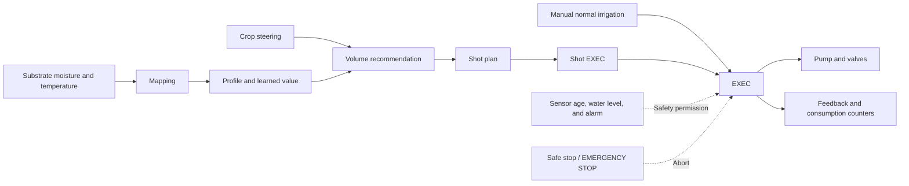

The delivered volume is calculated from pump runtime:

```text
pump runtime in seconds = requested volume in ml / pump output in ml/s
```

A flow meter is not required, so accurate pump calibration is essential. Pump
runtime starts with the switch-on command and is therefore not extended by a
delayed Wi-Fi state report. After the switch-off command, the controller waits
up to the configurable actuator confirmation time for a new `off` report. It
cannot detect a blocked dripper, a disconnected hose, or the volume that
physically flowed.

## Screenshots

The screenshots show the main pages of the supplied Home Assistant dashboard.
Click an image to open it at full size.

### Overview

[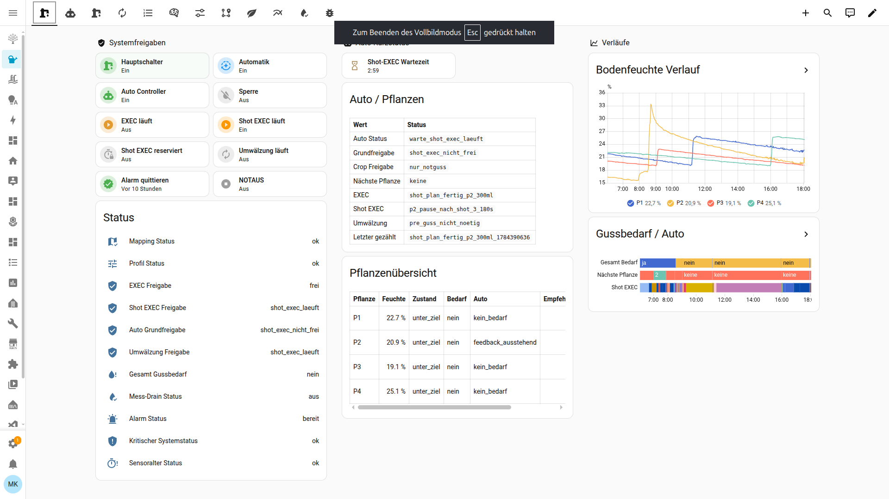](docs/images/overview.png)

| Automation | EXEC and manual irrigation |
|---|---|
| [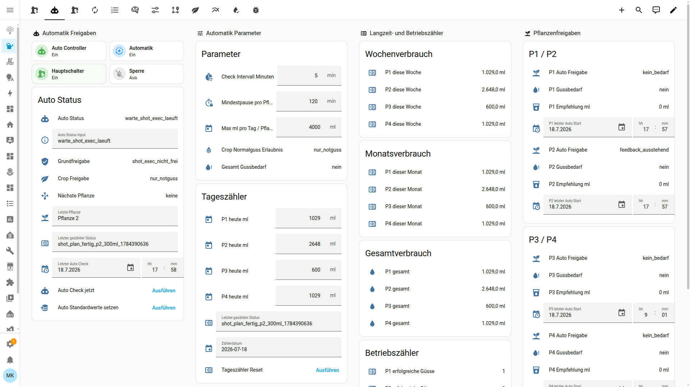](docs/images/automation.png) | [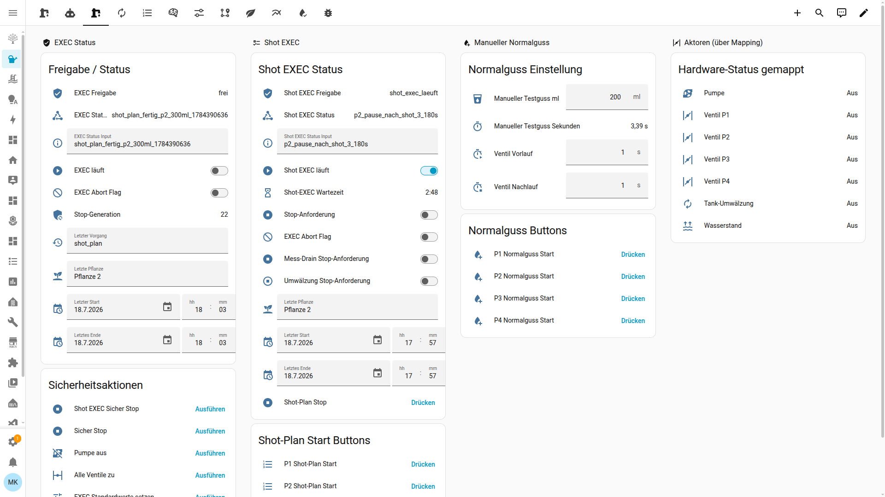](docs/images/exec.png) |

| Reservoir circulation | Shot plan |
|---|---|
| [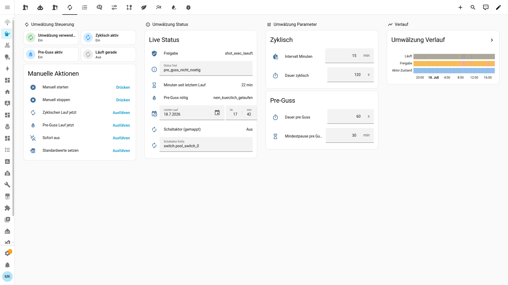](docs/images/circulation.png) | [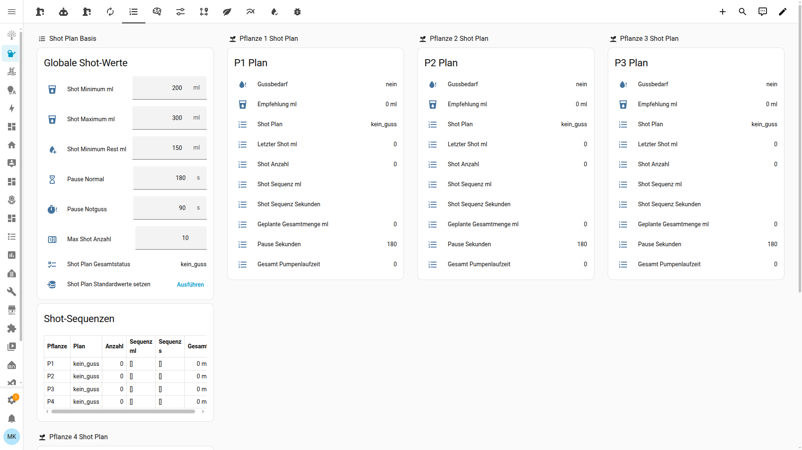](docs/images/shot-plan.png) |

| Self-learning feedback | Irrigation profile |
|---|---|
| [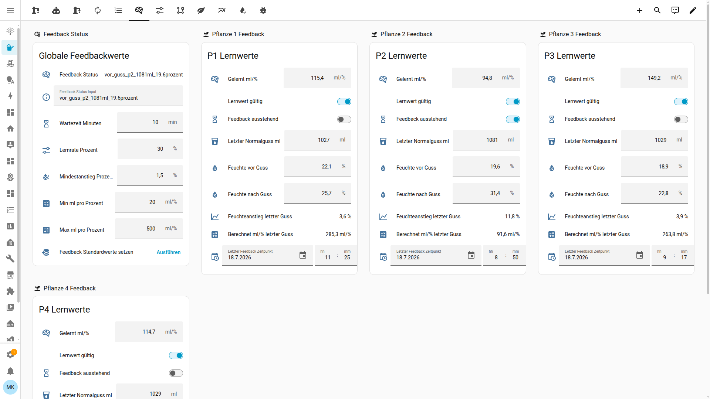](docs/images/self-learning-feedback.png) | [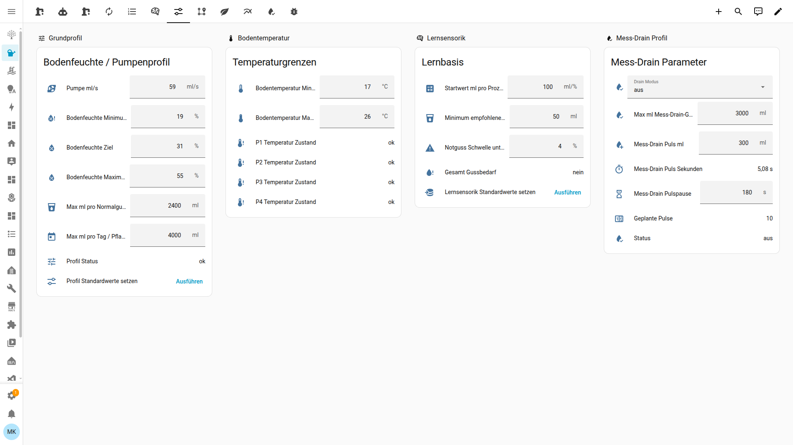](docs/images/profile.png) |

| Hardware and sensor mapping | Universal crop steering |
|---|---|
| [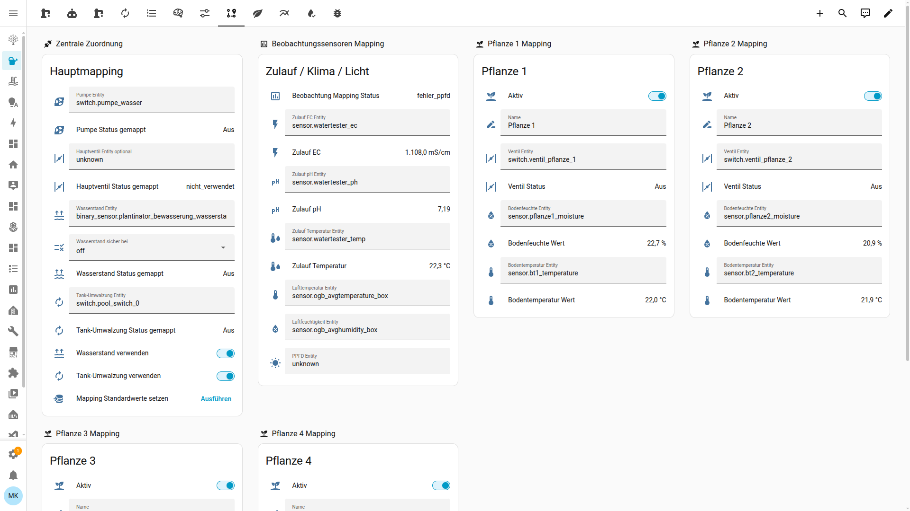](docs/images/mapping.png) | [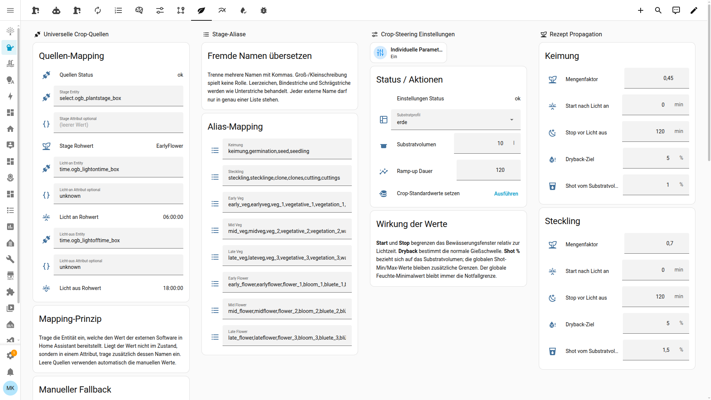](docs/images/crop-steering.png) |

| Monitoring and dryback | Measuring drain |
|---|---|
| [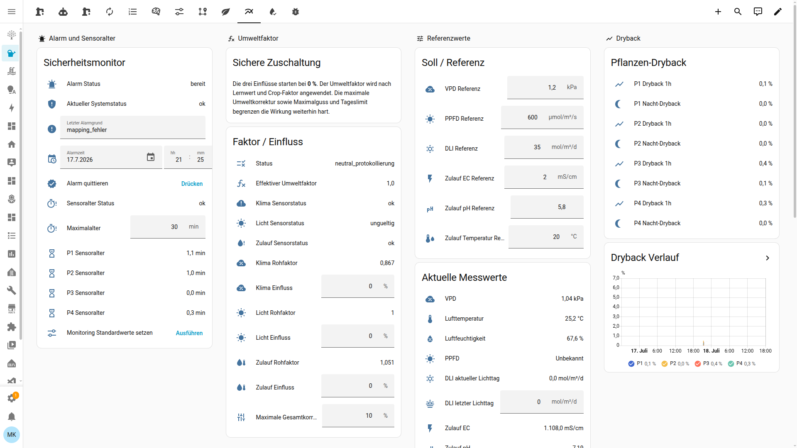](docs/images/monitoring.png) | [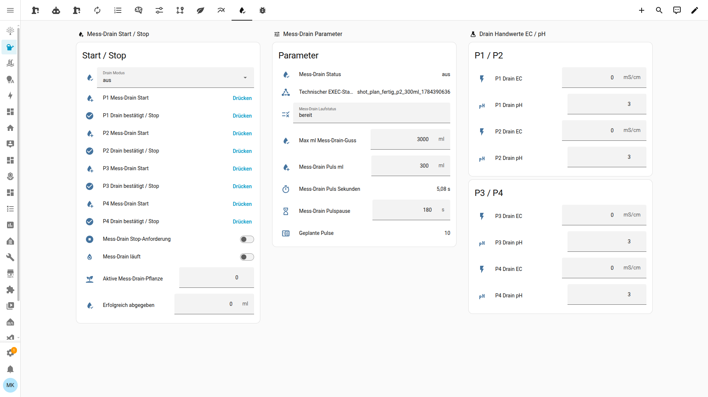](docs/images/mess-drain.png) |

### Debug and live diagnostics

[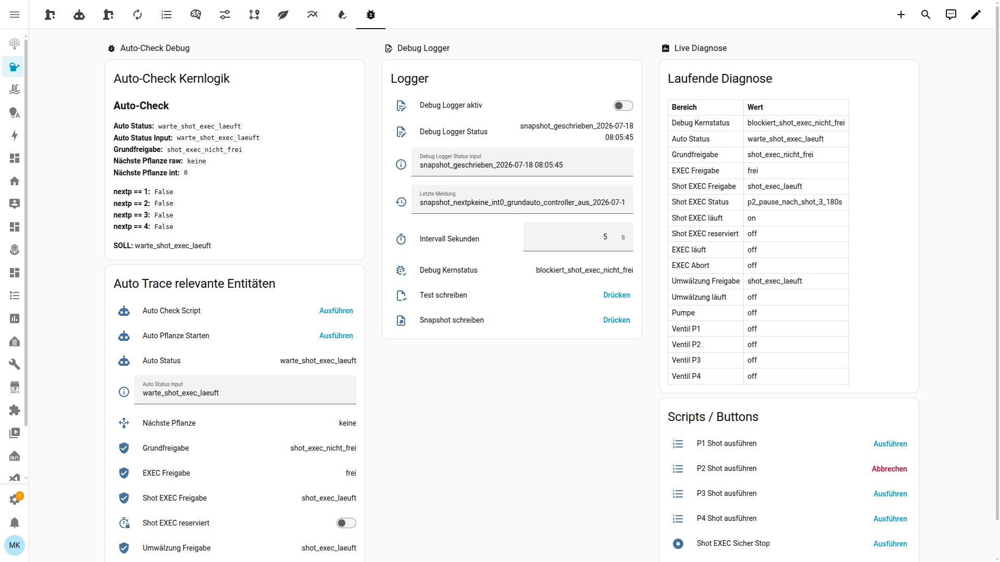](docs/images/debug.png)

## Requirements

### Software

- a current Home Assistant installation;
- access to `/config`;
- YAML packages enabled;
- a YAML-mode Lovelace dashboard;
- no custom cards—the dashboard only uses Home Assistant core cards.

### Required hardware entities

| Function | Expected entity | Notes |
|---|---|---|
| Shared pump | `switch.*` | Must reliably report its actual on/off state |
| Valve for each active plant | `switch.*` | One individual valve for P1 through P4 |
| Moisture for each active plant | numeric `sensor.*` | Expected range: 0–100% |
| Substrate temperature for each active plant | numeric `sensor.*` | Value in °C |

### Optional entities

| Function | Expected entity |
|---|---|
| Main valve | `switch.*` |
| Water level | `binary_sensor.*` or `input_boolean.*` |
| Reservoir circulation | `switch.*` |
| Input-water EC, pH, and temperature | numeric `sensor.*` for each value |
| Air temperature and humidity | numeric `sensor.*` for each value |
| PPFD | numeric `sensor.*` |

Crop steering can be operated manually or connected to any external system
whose values are available as a Home Assistant entity state or attribute:

| Crop source | Expected value |
|---|---|
| Plant stage | Any short text, for example `Stretch`, `Flower Week 4`, or `Blüte 2` |
| Lights on | Time as `HH:MM` or `HH:MM:SS` |
| Lights off | Time as `HH:MM` or `HH:MM:SS` |

The source domain is not fixed. `sensor.*`, `select.*`, `input_select.*`,
`text.*`, `time.*`, and `input_datetime.*` can all be used. If the required
value is stored in an attribute, map the attribute name separately. If no
external source is configured, the system uses the manual stage and light-time
helpers.

## Project files

| File | Purpose |
|---|---|
| [`plantinator_bewasserung_mapping.yaml`](plantinator_bewasserung_mapping.yaml) | Real hardware and plant-sensor mapping |
| [`plantinator_bewasserung_profil.yaml`](plantinator_bewasserung_profil.yaml) | Pump output, moisture, temperature, and volume limits |
| [`plantinator_bewasserung_lernsensorik.yaml`](plantinator_bewasserung_lernsensorik.yaml) | Moisture-state evaluation and volume recommendation |
| [`plantinator_bewasserung_crop_steering.yaml`](plantinator_bewasserung_crop_steering.yaml) | Source mapping, stage aliases, light times, and crop parameters |
| [`plantinator_shot_plan.yaml`](plantinator_shot_plan.yaml) | Splits a recommendation into individual shots |
| [`plantinator_bewasserung_exec.yaml`](plantinator_bewasserung_exec.yaml) | Safe pump and valve sequence |
| [`plantinator_bewasserung_shot_exec.yaml`](plantinator_bewasserung_shot_exec.yaml) | Executes complete shot plans |
| [`plantinator_bewasserung_auto_controller.yaml`](plantinator_bewasserung_auto_controller.yaml) | Plant selection, pauses, and automatic starts |
| [`plantinator_bewasserung_guss_feedback.yaml`](plantinator_bewasserung_guss_feedback.yaml) | Learning from moisture increase and delivered volume |
| [`plantinator_bewasserung_tank_umwalzung_v1.yaml`](plantinator_bewasserung_tank_umwalzung_v1.yaml) | Manual, cyclic, and pre-irrigation circulation |
| [`plantinator_mess_drain.yaml`](plantinator_mess_drain.yaml) | Supervised pulses until drainage is observed |
| [`plantinator_bewasserung_monitoring.yaml`](plantinator_bewasserung_monitoring.yaml) | Sensor age, environmental readings, dryback, and alarm latch |
| [`plantinator_bewasserung_startup_safety.yaml`](plantinator_bewasserung_startup_safety.yaml) | Safe state after Home Assistant starts |
| [`plantinator_bewasserung_debug_logger.yaml`](plantinator_bewasserung_debug_logger.yaml) | Optional diagnostic logger |
| [`dashboard.yaml`](dashboard.yaml) | Complete German Lovelace dashboard |
| [`dashboard_en.yaml`](dashboard_en.yaml) | Complete English Lovelace dashboard with identical logic |

All `plantinator*.yaml` files depend on one another and should be installed
together. The dashboard files are not package files and must not be copied
into the package directory.

## Installation

### 1. Create a backup

Create a full Home Assistant backup before installing the project. See the
official [Home Assistant backup documentation](https://www.home-assistant.io/common-tasks/general/).

### 2. Copy the package files

Create, for example:

```text
/config/packages/universal_irrigation/
```

Copy every `.yaml` file whose name begins with `plantinator` into this
directory. A valid layout is:

```text
/config/
├── configuration.yaml
├── dashboard_en.yaml
└── packages/
    └── universal_irrigation/
        ├── plantinator_bewasserung_auto_controller.yaml
        ├── plantinator_bewasserung_crop_steering.yaml
        ├── plantinator_bewasserung_debug_logger.yaml
        ├── plantinator_bewasserung_exec.yaml
        ├── plantinator_bewasserung_guss_feedback.yaml
        ├── plantinator_bewasserung_lernsensorik.yaml
        ├── plantinator_bewasserung_mapping.yaml
        ├── plantinator_bewasserung_monitoring.yaml
        ├── plantinator_bewasserung_profil.yaml
        ├── plantinator_bewasserung_shot_exec.yaml
        ├── plantinator_bewasserung_startup_safety.yaml
        ├── plantinator_bewasserung_tank_umwalzung_v1.yaml
        ├── plantinator_mess_drain.yaml
        └── plantinator_shot_plan.yaml
```

Enable packages in `configuration.yaml`:

```yaml
homeassistant:
  packages: !include_dir_named packages
```

If a `homeassistant:` block already exists, only add the `packages:` line to
that block. Do not create a second `homeassistant:` block. See the official
[Home Assistant packages documentation](https://www.home-assistant.io/docs/configuration/packages/).

### 3. Install the dashboard

Choose the desired language:

- `dashboard.yaml` for German;
- `dashboard_en.yaml` for English.

Copy the selected file directly into `/config`. The following example uses
the English dashboard:

Add this configuration:

```yaml
lovelace:
  dashboards:
    universal-irrigation-en:
      mode: yaml
      filename: dashboard_en.yaml
      title: Universal Self-Learning Irrigation for Home Assistant
      icon: mdi:water-pump
      show_in_sidebar: true
      require_admin: true
```

The dashboard key must contain a hyphen. Because the dashboard can switch
physical actuators, `require_admin: true` is strongly recommended. You can
also configure both files with different dashboard keys. Both dashboards
control the same entities, so a parameter changed in one language view is
immediately visible in the other. See the Home Assistant guide to
[multiple YAML dashboards](https://www.home-assistant.io/dashboards/dashboards/).

### 4. Optional: prepare the diagnostic logger

This step is only required if the debug logger should write files. Skip it if
**Debug Logger Enabled** remains off.

Extend the existing `homeassistant:` block:

```yaml
homeassistant:
  packages: !include_dir_named packages
  allowlist_external_dirs:
    - /config/plantinator_diag
```

Create:

```text
/config/plantinator_diag
```

Then add Home Assistant's **File** integration:

1. Open **Settings → Devices & services → Add integration**.
2. Select **File**.
3. Set the path to
   `/config/plantinator_diag/plantinator_v3_snapshot.txt`.
4. Rename the generated notify entity to `notify.plantinator_status`.

The logger uses `notify.send_message` and expects this exact entity ID. See the
official [File integration documentation](https://www.home-assistant.io/integrations/file/).

### 5. Validate and restart

1. Open **Developer tools → YAML**.
2. Run the configuration check.
3. Correct every reported error.
4. Fully restart Home Assistant.

A complete restart is more reliable than partial reloads during first
installation because the packages create many helpers, scripts, and
automations.

## Safe initial setup

### 1. Keep the system locked

Immediately after the restart, verify on **Overview**:

- **Main Switch**: off;
- **Automation**: off;
- **Auto Controller**: off;
- **System Lock**: on;
- **EXEC Running**: off;
- **Shot EXEC Running**: off;
- **Circulation Running**: off.

Twenty seconds after Home Assistant starts, startup safety switches off the
pump, circulation, and every mapped valve. An interrupted irrigation event is
deliberately not resumed. If all three automatic-control switches remain
enabled, a new automatic check is delayed for two minutes.

### 2. Configure the hardware mapping

Open **Mapping**.

#### Central mapping

- **Pump Entity**: the `switch.*` entity of the shared water pump;
- **Optional Main-Valve Entity**: leave blank or enter a `switch.*`;
- **Water-Level Entity**: optional `binary_sensor.*` or `input_boolean.*`;
- **Water Level Safe When**: select `on` or `off` to match the real sensor;
- **Reservoir-Circulation Entity**: optional circulation `switch.*`;
- enable **Use Water Level** only after verifying the entity and safe
  state;
- enable **Use Reservoir Circulation** only if circulation hardware exists.

#### Mapping each plant

For P1 through P4:

- enable **Enabled** only for installed plants;
- enter a freely chosen **Name**;
- set **Valve Entity** to a `switch.*`;
- set **Substrate-Moisture Entity** to a numeric `sensor.*`;
- set **Substrate-Temperature Entity** to a numeric `sensor.*`.

Set **Number of Plants** in Main Mapping to the installed count from 1 to 4.
Only enabled plants within this count are evaluated by sensor-age monitoring
and automatic control.

#### Observation sensors

Input-water, climate, and PPFD sensors are optional. They support monitoring
and diagnostic environmental factors. They do not change the self-learning
irrigation volume. Missing observation sensors do not block core irrigation.

**Set Safe Mapping Basics** selects four plants, neutral plant names, and
disables the optional water-level and circulation features. It deliberately
does not write pump, valve, or sensor entity IDs. Always enter those IDs
manually to match the real installation.

**Mapping Status** must display `ok`.

### 3. Initialize base values

The YAML helpers intentionally do not enforce `initial:` values so that your
settings survive restarts. On a new installation, run the initialization
scripts once while the main switch is off and the system lock is on:

1. **Set Profile Defaults**
2. **Set Learning Defaults**
3. **Set Shot Plan Defaults**
4. **Set EXEC Defaults**
5. **Set Feedback Defaults**
6. **Set Automation Defaults**
7. **Set Monitoring Defaults**
8. **Set Defaults** on the Circulation page, if used
9. **Set Crop Defaults**
10. **Set Debug Defaults**, if the optional logger is used

The automation script disables the auto controller and resets daily counters.
The feedback script invalidates existing learned values. Do not rerun these
scripts casually on an already trained system.

The debug defaults disable the logger and set its interval to 60 seconds.

**Set Safe Mapping Basics** is optional. Afterwards adjust **Number of Plants**
and each Enabled switch, then enter every required entity ID manually.

### 4. Configure the irrigation profile

Open **Profile** and set:

- measured pump output in ml/s;
- substrate-moisture minimum, target, and maximum;
- maximum volume per normal irrigation;
- maximum daily volume per plant;
- permitted substrate-temperature range;
- measuring-drain limits.

Only the following relationships are valid:

```text
moisture minimum < moisture target < moisture maximum
temperature minimum < temperature maximum
pump output > 0
```

**Profile Status** must display `ok`.

### 5. Verify the sensors

Under **Mapping**, **Overview**, and **Monitoring**, verify:

- every active moisture value is numeric and plausible;
- every active substrate-temperature value is numeric and plausible;
- sensor values update regularly;
- **Sensor-Age Status** is `ok`;
- **Critical System Status** is `ok`;
- **Alarm Status** is `bereit`.

The default maximum sensor age is 30 minutes.

### 6. Configure crop steering

Open **Crop Steering** and first run **Set Crop Defaults**. This writes
conservative phase recipes, common stage aliases, a substrate volume of
10 litres, and manual light times from 06:00 to 18:00. All recipe values can
then be edited in the dashboard.

To connect an external system:

1. Under **Universal Crop Sources**, enter the entity ID for plant stage.
2. If the value is not the entity state, enter its attribute name.
3. Repeat this for lights-on and lights-off times.
4. Read the displayed **Raw Stage Value**.
5. Add that value to exactly one internal stage under **Stage Aliases**.
6. Verify that **Source Status** and **Settings Status** display `ok`.
7. Enter the actual substrate volume under **Crop-Steering Settings**.
8. Verify active recipe, irrigation threshold, shot size, crop day phase, and
   normal-irrigation permission.

Without external software, leave all three entity fields empty and configure
stage and light times under **Manual Fallback**. A source status of
`manuell` is a valid operating state.

#### Mapping different stage names

Internally, the controller always uses these eight stages:

```text
keimung
steckling
early_veg
mid_veg
late_veg
early_flower
mid_flower
late_flower
```

External names are translated through comma-separated alias lists:

| External raw value | Alias list | Internal stage |
|---|---|---|
| `Seedling` | Keimung | `keimung` |
| `Vegetation Week 2` | Mid Veg | `mid_veg` |
| `Stretch` | Early Flower | `early_flower` |
| `Flower Week 4` | Mid Flower | `mid_flower` |
| `Ripening` | Late Flower | `late_flower` |

Matching is case-insensitive. Spaces, hyphens, and slashes are normalized like
underscores, so `Flower Week 4`, `flower-week-4`, and `flower_week_4` match the
same alias. An alias must occur in only one list. Unknown or ambiguous values
produce the internal stage `unbekannt`, and automatic control safely changes
to `nur_manuell`.

## Default values and calibration

The **Set Defaults** buttons write the following starting values. They
are examples, not universal recommendations.

### Base profile

| Parameter | Default |
|---|---:|
| Pump output | 50 ml/s |
| Moisture minimum | 32% |
| Moisture target | 42% |
| Moisture maximum | 55% |
| Maximum normal irrigation | 500 ml |
| Daily limit per plant | 1200 ml |
| Maximum measuring-drain volume | 1200 ml |
| Measuring-drain pulse | 200 ml |
| Measuring-drain pause | 180 s |
| Minimum substrate temperature | 17 °C |
| Maximum substrate temperature | 26 °C |

### Learning and feedback

| Parameter | Default |
|---|---:|
| Initial value | 35 ml/% |
| Minimum recommended irrigation | 50 ml |
| Emergency threshold below minimum | 5 percentage points |
| Feedback wait | 10 min |
| Learning rate | 30% |
| Minimum moisture increase | 2% |
| Lower learned-value limit | 20 ml/% |
| Upper learned-value limit | 250 ml/% |
| Begin outlier check after | 3 accepted samples |
| Maximum outlier deviation | 50% from the existing learned value |
| Maximum learned-value change per sample | 20% |
| Full learning confidence after | 5 accepted samples |
| Peak-drop diagnostic threshold | 3 moisture percentage points |

> [!IMPORTANT]
> When updating an installation that already has learned plant values, use
> **Set New Protection Values (Keep Learned Values)** on the dashboard. It
> only applies the feedback delay, outlier protection, update limit,
> confidence target, and peak diagnostic defaults. **New Pot / Substrate –
> Reset Learning Baseline** is intended for a change of pot, pot size,
> substrate, or a similarly fundamental change. It restores the learning and
> feedback parameters listed above, clears learned values, validity flags,
> counters, histories, old before/after-irrigation measurements, and peak
> diagnostics, then initializes the crop peaks from the configured soil
> moisture target. Ramp-up completion is also reset for every plant. Mapping,
> pump calibration, safety limits, crop recipes, and consumption counters are
> preserved.

### Shot plan

| Parameter | Default |
|---|---:|
| Minimum shot | 50 ml |
| Maximum shot | 200 ml |
| Minimum remainder | 100 ml |
| Normal pause | 180 s |
| Emergency-irrigation pause | 90 s |
| Maximum number of shots | 10 |

### Crop-steering phase recipes

These values are conservative starting points for sensor-controlled irrigation
in coco or rockwool. Pot size, substrate, drippers, climate, sensor position,
and cultivar must be considered during calibration.

| Internal stage | Start after lights on | Stop before lights off | Overnight/ramp-up dryback | Maintenance dryback | Shot as substrate volume |
|---|---:|---:|---:|---:|---:|
| `keimung` | 0 min | 120 min | 5% | 2.0% | 1.0% |
| `steckling` | 0 min | 120 min | 5% | 2.0% | 1.5% |
| `early_veg` | 30 min | 60 min | 8% | 2.5% | 2.0% |
| `mid_veg` | 45 min | 90 min | 8% | 3.0% | 3.0% |
| `late_veg` | 90 min | 150 min | 12% | 3.5% | 3.5% |
| `early_flower` | 150 min | 210 min | 18% | 4.0% | 5.0% |
| `mid_flower` | 90 min | 150 min | 12% | 3.0% | 3.5% |
| `late_flower` | 120 min | 180 min | 18% | 4.0% | 4.0% |

Additional crop defaults:

| Parameter | Default |
|---|---:|
| Substrate profile | `coco` |
| Substrate volume | 10 l |
| Ramp-up shot factor | 60% |

`ramp_up` no longer has a fixed duration. After its earliest start time, each
plant waits until `stored peak − ramp-up dryback` is reached. The complete
calculated water loss is then delivered as one full sequence. The ramp-up
factor only reduces the size of individual shots: a 300 ml base shot becomes
180 ml at 60%. The global minimum shot remains a hard lower bound. After a
successful sequence and feedback, only that plant enters `maintenance`, where
normal shot sizes and the stage-specific maintenance dryback apply. The
**Set Maintenance Starting Values Only** button writes only the eight
maintenance values in this table and leaves every other setting unchanged.

“Full sequence” does not bypass safety limits: maximum normal irrigation still
caps the recommendation. If the configured maximum shot count cannot hold the
complete list, Shot EXEC blocks the start and reports
`blockiert_zu_viele_shots`.

The separation into ramp-up, maintenance, and overnight dryback follows a
controlled cannabis study on precision irrigation. Its maintenance phase
held stage-specific VWC target ranges, with more frequent irrigation during
flower bulking. This is why the `mid_flower` maintenance dryback is narrower
than the early- and late-flower values. Another controlled study found that
water stress during flowering can reduce inflorescence biomass. The 2.0–4.0
values are therefore deliberately mild **engineering starting values**, not
scientifically validated SMT100 thresholds.

Sensor scales and substrates are not directly interchangeable. The study used
rockwool and different substrate sensors; this project has only been
practically tested with the TRUEBNER SMT100. A 3% maintenance dryback here
means that the mapped reading may fall by 3 **percentage points** from the
most recently stored peak.

- [Karnoutsos et al. 2026 – three-phase precision irrigation in medicinal cannabis](https://www.mdpi.com/2311-7524/12/5/619)
- [Water Stress Effects on Biomass Allocation and Secondary Metabolism in Cannabis sativa](https://www.mdpi.com/2223-7747/14/8/1267)
- [Grodan – Precision Irrigation in Cannabis (PDF)](https://www.grodan.com/siteassets/downloads/downloads-na-101/grow-guide-2023/precision-irrigation.pdf)
- [AROYA – Drybacks 101](https://aroya.io/education-guides/drybacks-101)
- [Botanicare – Irrigation Strategies for Coco Pro and Rockwool](https://www.botanicare.com/hydro-101/irrigation-strategies-cocopro-rockwool/)

### EXEC, automation, and circulation

| Parameter | Default |
|---|---:|
| Manual test irrigation | 100 ml |
| Valve pre-run | 1 s |
| Valve post-run | 1 s |
| Maximum actuator confirmation time | 8 s |
| Automatic check interval | 5 min |
| Minimum pause per plant | 45 min |
| Circulation interval | 180 min |
| Cyclic circulation duration | 120 s |
| Pre-irrigation circulation duration | 60 s |
| Minimum pre-irrigation circulation pause | 30 min |

### Monitoring and environmental diagnostics

| Parameter | Default |
|---|---:|
| Maximum sensor age | 30 min |
| Climate influence | 0% |
| Light influence | 0% |
| Input-water influence | 0% |
| Maximum diagnostic correction | 10% |
| VPD reference | 1.2 kPa |
| PPFD reference | 600 µmol/m²/s |
| DLI reference | 35 mol/m² |
| Input-water EC reference | 2.0 |
| Input-water pH reference | 5.8 |
| Input-water temperature reference | 20 °C |

All three environmental influences begin at 0%. Their raw and effective
factors are retained as diagnostic and simulation values. They do not alter
self-learning irrigation volume, which is calculated only from peak loss and
the learned ml/% value. The helpers remain for compatibility.

### Calibrate pump output

1. Route the plant outlet into a measuring vessel.
2. Prime a non-self-priming pump. Never dry-run a pump that is not designed
   for it.
3. Run the pump for an exactly measured time.
4. Measure the delivered volume.
5. Calculate:

```text
pump output = measured volume / runtime
```

Example:

```text
500 ml / 10 s = 50 ml/s
```

Repeat the test at least three times under the actual hose, height, and
pressure conditions. Use the average and repeat calibration periodically as
filters, pipes, drippers, and pumps age.

## Commissioning

Perform these steps in person and in this order:

1. Main switch off, automation off, auto controller off, system lock on.
2. Confirm that the physical pump is off and every valve is closed.
3. Check mapping, sensor values, water level, and profile.
4. Route the first plant outlet into a measuring vessel.
5. Turn the lock off and the main switch on.
6. Under **EXEC → Manual Normal Irrigation**, set a small, safe test volume.
7. Start only P1 and observe the complete sequence:
   - pump initially off;
   - all other valves closed;
   - optional main valve opened;
   - selected plant valve opened;
   - pump on;
   - pump off;
   - post-run delay;
   - valves closed.
8. Measure the actual volume and correct pump output.
9. Repeat for every active plant.
10. During a small test, verify **EMERGENCY STOP** or **Safe Stop**.
11. During a supervised test, place the water-level sensor in its unsafe
    state. The process must stop and the alarm must latch.
12. Correct the cause before acknowledging the alarm.
13. Operate and observe the system manually for several days.
14. Only then enable automation and the auto controller.

After every test, the pump, main valve, and all plant valves must be off.

## Operation

### Overview

**Overview** is the daily operating page.

#### System permissions

| Dashboard label | Function |
|---|---|
| Main Switch | Global permission for normal processes |
| Automation | Allows automatic irrigation decisions |
| Auto Controller | Runs periodic automatic checks |
| System Lock | Blocks new starts and triggers safe stop when enabled |
| EXEC Running | The core pump sequence is active |
| Shot EXEC Running | A complete shot plan is active |
| Shot EXEC Reserved | A shot process has reserved the system, possibly before pre-irrigation circulation |
| Circulation Running | The circulation actuator is active |
| Acknowledge Alarm | Clears the latch only after critical system status returns to `ok` |
| EMERGENCY STOP | Stops pump, circulation, and valves and requests all active operations to abort |

#### Automatic short status

**Shot-EXEC Wait Time** is the shared timer for:

- pauses between two shots;
- the feedback wait after the final shot.

It is therefore not simply the remaining pump runtime. When idle it is
finished or inactive.

The plant overview shows moisture, moisture state, irrigation demand,
automatic permission, recommended volume, today's consumption, and the
calculated shot sequence.

### Automatic mode

All three switches must be on for an automatic start:

- **Main Switch**;
- **Automation**;
- **Auto Controller**.

The system lock and alarm must be off, and all safety permissions must pass.
The controller checks on the configured interval and after relevant state
changes.

**Plant Permissions** shows the exact rejection reason for each plant. An
automatic start uses the calculated recommendation and executes it through the
shot plan.

Daily counters reset at 00:05. Weekly and monthly consumption use Home
Assistant utility meters.

### EXEC

#### Manual normal irrigation

Manual normal irrigation uses **Manual Test Irrigation ml**. It does not
automatically use the calculated recommendation.

1. Enter the requested volume.
2. Verify all safety statuses.
3. Press the start button for one plant.
4. Supervise the process.
5. Wait for feedback to finish.

Manual irrigation still requires valid EXEC permission. Pending feedback for
the same plant can block another process.

The volume is capped by **Maximum ml per Normal Irrigation**, but a manual start does not
apply the automatic crop rule, minimum plant pause, or daily limit. The
operator must verify those limits.

#### Manually start a shot plan

The four shot-plan buttons start the currently calculated sequence. Before
starting, verify:

- irrigation demand exists;
- recommendation and shot sequence are plausible;
- today's consumption plus recommendation stays below the daily limit;
- crop permission and current day phase allow irrigation;
- no other process has reserved the controller.

A manual shot start checks demand, recommendation, shot limits, plant sensors,
and general safety permissions. It does not apply the full automatic crop,
minimum-pause, and daily-limit permission. The operator remains responsible
for these three checks.

Use **Stop Shot Plan** or **Shot EXEC Safe Stop** to abort.

#### Safety actions

- **Shot EXEC Safe Stop** stops the shot timer and shot execution.
- **Safe Stop** performs a global safe shutdown.
- **Pump Off** only switches off the mapped pump.
- **Close All Valves** closes the main and all plant valves.

If in doubt, always use **Safe Stop**.

### Shot plan

For every plant, this page shows:

- irrigation demand and recommendation;
- number of shots;
- sequence in ml;
- calculated pump runtimes;
- planned total volume;
- pause between shots;
- total pump runtime.

Larger recommendations are split according to **Shot Maximum**. If a remainder
would be smaller than **Shot Minimum Rest**, the total is distributed as
evenly as possible across all shots. The hard shot maximum is therefore never
exceeded. The executor uses the exact displayed ml sequence and verifies the
success state after every shot. Sequences containing a technically
non-executable individual shot below 25 ml are safely blocked. Emergency
irrigation uses the shorter emergency pause.

### Feedback

After normal or shot irrigation:

1. the moisture value before irrigation is stored;
2. **Feedback Pending** remains enabled;
3. the controller automatically tracks the highest reported moisture value;
4. it waits for the configured feedback delay;
5. it stores the then-stabilized reading;
6. it calculates moisture increase, peak drop, and, when valid, a new learned
   value.

Another irrigation of the same plant is blocked during this transaction. Do
not modify the plant's sensor mapping, learned values, or feedback flags while
feedback is pending.

### Reservoir circulation

Reservoir circulation is optional and requires a mapped `switch.*`.

- **Use Circulation** enables the hardware globally.
- **Cyclic Mode Enabled** starts a timed run when the interval expires.
- **Pre-Irrigation Enabled** circulates before irrigation when its minimum pause has
  expired.
- **Start Manually/Stop Manually** directly controls it.
- **Switch Off Now** switches off the circulation actuator.

Irrigation has priority. An EXEC or shot process stops or blocks circulation.

### Measuring drain

> [!WARNING]
> With default settings, measuring drain can deliver up to 1200 ml in one
> process. Supervise this mode continuously.

This mode delivers pulses until drainage becomes visible:

1. Under **Measuring Drain**, set **Drain Mode** to `manuell`.
2. Check maximum volume, pulse volume, and pulse pause.
3. Prepare a drain measuring vessel.
4. Press the start button for the selected plant.
5. Watch the process continuously.
6. As soon as drainage is visible, press **Drain Confirmed / Stop** for the
   same plant.
7. Read **Successfully Delivered**.
8. Optionally record drain EC and pH manually.
9. Return **Drain Mode** to `aus`.

Without confirmation, the process stops no later than the maximum volume.
Manual drain EC and pH values are logged but do not automatically control
irrigation.

### Profile and mapping

These are configuration pages, not daily operating pages. Mapping, pump
output, threshold, and maximum-volume changes can affect the next process
immediately. Only change them while the system lock is on and automation is
off.

### Crop steering

Each internal stage has a fully editable recipe:

- earliest start in minutes after lights on;
- final irrigation time in minutes before lights off;
- desired overnight/ramp-up dryback as a direct moisture difference;
- a separate maintenance dryback as a direct moisture difference;
- shot size as a percentage of substrate volume.

**Custom Parameters** determines whether dashboard values are used. If it
is off or **Settings Status** reports an error, the documented default
values are used. An unknown or ambiguously mapped stage still blocks automatic
irrigation.

#### Dryback and irrigation threshold

Each plant uses its own most recently measured successful peak. Dryback is
subtracted as a direct difference and does not require relative conversion:

```text
ramp-up trigger =
  max(moisture minimum, stored peak - ramp-up dryback)

maintenance trigger =
  max(moisture minimum, stored peak - maintenance dryback)
```

Example: a stored peak of 32%, dryback of 5%, and minimum of 19% produce a
trigger of 27%; ramp-up is released at 27% or below. A dryback of 18% would
mathematically produce 14%, so the hard minimum clamps the trigger to 19%.

The global moisture minimum is therefore a hard lower bound for normal crop
steering. `kritisch_trocken` only begins below **minimum minus emergency
threshold**. A crop recipe cannot lower this emergency logic.

Until a successful peak is available, the configured **Moisture Target** is
used as the peak fallback.
The maintenance dryback may not exceed the active recipe's overnight dryback;
otherwise Settings Status reports
`fehler_maintenance_groesser_overnight`.

> [!IMPORTANT]
> Capacitive moisture-sensor percentages are not standardized volumetric water
> content. Calibrate target, minimum, and dryback with the installed sensor and
> substrate. Change dryback targets gradually and observe several complete
> light cycles.

#### Dynamic shot size

The target size of one shot is:

```text
shot ml =
  substrate volume in litres
  × 1000
  × shot percentage
  / 100
```

For example, 3% of a 10-litre substrate volume is 300 ml. Global **Shot
Minimum** and **Shot Maximum** clamp the result. Total recommendation, maximum
normal irrigation, maximum shot count, and daily limit remain additional
constraints.

**Substratprofil** identifies the configured basis (`coco`, `steinwolle`,
`erde`, or `benutzerdefiniert`). It does not silently change values; the
actual recipe remains visible and editable.

#### Plant phases and complete sequences

The global day phase only defines the safe irrigation window. Within that
window, every plant advances independently:

- `warte_licht`: earliest start time has not been reached;
- `warte_dryback`: start time reached, dryback not yet reached;
- `ramp_up`: dryback reached; complete sequence with smaller shots;
- `maintenance`: ramp-up and feedback completed successfully;
- `overnight_dryback`: stop time before lights off reached;
- `nacht`: lights off.

Ramp-up restores the water loss to the stored peak:

```text
deficit = stored peak - current moisture
total volume = deficit × learned ml per percentage point
```

The shot plan divides that total into smaller ramp-up shots, and Shot EXEC
runs the complete list. Only after successful feedback is the stabilized
reading stored as the new peak and **Ramp-Up Complete** set. Abort, alarm, or
hardware failure does not perform this transition. Maintenance uses the same
loss calculation with normal shots and the smaller maintenance dryback.

At the next transition to lights on, ramp-up completion is reset exactly once
per light day for every plant. A stored light-day key prevents a Home
Assistant restart during the light period from repeating the same reset.
Critical emergency irrigation may remain possible if all other safety checks
pass.

If start delay plus stop-before-lights-off is at least as long as the light
period, settings status becomes `fehler_keine_bewaesserungszeit` and automatic
normal irrigation is blocked.

### Monitoring

The Monitoring page contains:

- alarm state and latest alarm reason;
- age of active plant sensors;
- climate, light, and input-water sensor status;
- diagnostic raw and effective factors;
- VPD, PPFD, and DLI;
- input-water EC, pH, and temperature;
- one-hour and overnight dryback;
- history graphs.

Monitoring dryback values show measured development. Ramp-up dryback and
maintenance dryback control the corresponding normal-irrigation thresholds
but do not change the hard emergency threshold.

### Debug

The Debug page shows automatic decisions, permissions, flags, and mapped
actuator states. If the File logger is configured, it can write test messages,
single snapshots, or periodic snapshots.

The periodic logger is off by default. Enabling it clears the existing target
file before new snapshots are written.

## Automatic control in detail

### Irrigation demand

Substrate moisture is classified approximately as follows:

| Internal state | Condition |
|---|---|
| `kritisch_trocken` | Below safety minimum minus emergency threshold |
| `trocken` | Below active crop irrigation threshold |
| `unter_ziel` | Between active crop threshold and target |
| `zielbereich` | Between target and maximum |
| `zu_nass` | Above maximum |
| Sensor error | No valid numeric value from 0 through 100 |

A critical temperature state blocks normal irrigation. For a critically dry
plant, emergency logic can take priority.

### Volume recommendation

In simplified form:

```text
moisture deficit = max(0, stored peak - current moisture)

recommendation =
  moisture deficit
  × ml per percentage point
```

Minimum irrigation and maximum normal-irrigation volume then clamp the
recommendation. Automatic plant permission also checks the daily limit.
Manual starts bypass that automatic check. Until a valid learned value exists,
the configured initial ml/% value is used.

### Plant selection

A plant only receives automatic permission if, among other requirements:

- it is enabled and within the configured plant count;
- irrigation demand exists;
- no feedback is pending;
- crop steering permits irrigation;
- the minimum pause since the last automatic start has expired;
- recommendation and daily limit allow the process.

Selection is based on urgency:

1. eligible plants requiring emergency irrigation first;
2. then the largest positive difference calculated as
   `individual irrigation threshold - current moisture`;
3. the lower plant number if priorities are equal.

This makes the selection account for the plant-specific peak and the active
ramp-up or maintenance threshold. Priority is recalculated from current states
after every completed process.

### Mutual exclusion

Pump EXEC, normal irrigation, shot plans, measuring drain, and reservoir
circulation are mutually interlocked. Shot execution reserves the controller
before optional pre-irrigation circulation so that another process cannot
start in between.

## Self-learning feedback

The measured response of an irrigation event is:

```text
calculated ml/% = delivered volume / moisture increase
```

Learning occurs only if:

- valid feedback is pending;
- moisture before and after irrigation is valid;
- delivered volume is greater than zero;
- moisture increase reaches the configured minimum;
- the calculated response is within the hard lower and upper limits;
- after the initial learning period, the sample does not deviate from the
  existing learned value by more than the configured limit.

After three accepted samples by default, a new response is considered an
outlier if it deviates from the existing learned value by more than 50%. The
outlier is recorded but does not modify the learned value. Accepted samples
are smoothed:

```text
new learned value =
  old value × (1 - learning rate)
  + clamped measured value × learning rate
```

At a 30% learning rate, 30% of the new measurement and 70% of the existing
value form the update. The stored value is additionally limited to a maximum
20% change per accepted sample by default. For each plant, the dashboard
shows the accepted sample count, rejected outliers, the last four results, and
a confidence indicator. Confidence rises linearly to 100% after five accepted
samples. It indicates maturity of the data set, not a statistical guarantee.
Measuring-drain processes are excluded from learning.

### Moisture peak and stability diagnostics

Peak tracking begins when a normal irrigation starts. Every new valid SMT100
reading during irrigation and the feedback wait is compared with the previous
maximum. After ten minutes, the current stabilized reading is stored:

```text
peak drop = highest value since irrigation start − value after feedback wait
```

A drop above the configurable threshold is shown as `auffaellig`. It may
indicate redistribution, preferential flow, unsuitable sensor placement, or
an overly fast/large sequence. It is **not reliable drain detection**: one
sensor only measures at its own position and cannot directly observe water
leaving the container. This diagnostic therefore triggers no alarm and does
not modify irrigation volumes or permissions.

Capacitive moisture sensors can respond slowly, non-linearly, and differently
depending on position. The learned value is therefore a practical control
quantity, not an exact physical substrate constant.

## Monitoring and alarm latch

### Critical system status

Status is only `ok` if:

- Mapping Status is `ok`;
- Profile Status is `ok`;
- all active plants have valid and sufficiently recent moisture and
  temperature readings;
- Actuator Safety Status is `ok`;
- an enabled water-level sensor is valid;
- water level matches the selected safe state.

Possible status groups include:

| Internal status | Meaning |
|---|---|
| `mapping_fehler` | At least one required mapping is invalid |
| `profil_fehler` | Pump, moisture, or temperature profile is invalid |
| `sensoralter_pX_bodenfeuchte_ungueltig` | Moisture sensor is missing or non-numeric |
| `sensoralter_pX_bodentemperatur_ungueltig` | Temperature sensor is missing or non-numeric |
| `sensoralter_pX_bodenfeuchte_veraltet` | Moisture reading is older than allowed |
| `sensoralter_pX_bodentemperatur_veraltet` | Temperature reading is older than allowed |
| `aktor_pumpe_unerwartet_an` | Pump is on outside an EXEC run |
| `aktor_pumpe_ohne_pflanzenventil` | Pump runs without an open plant valve |
| `aktor_pflanzenventil_unerwartet_offen` | A plant valve is open outside an EXEC run |
| `aktor_mehrere_pflanzenventile_offen` | More than one plant valve is open |
| `aktor_*_unverfuegbar_im_lauf` | A required actuator became unavailable during a run |
| `wasserstand_ungueltig` | Water-level entity is missing or invalid |
| `wasserstand_nicht_sicher` | Water level does not match the selected safe state |

A general critical fault that persists for two minutes latches the alarm.
During an active water process, unsafe water level and contradictory actuator
states trigger the alarm and safe stop after approximately two seconds. For
slow-reporting Wi-Fi actuators, EXEC waits no longer than the configurable
actuator confirmation time when opening a valve and after switching the pump
off. A missing confirmation then latches immediately. A delayed pump `on`
report does not extend the calculated dosing time.

### Alarm status

| Internal status | Meaning |
|---|---|
| `bereit` | No current critical error and no stored latch |
| `verriegelt` | Alarm is stored and all pump processes remain blocked |
| `fehler_nicht_quittierbar` | The cause still exists, so acknowledgement is rejected |

### Correctly acknowledge an alarm

1. Turn the main switch off or the system lock on.
2. Read the latest alarm reason.
3. Inspect the physical installation for leaks, dry running, detached hoses,
   and valve state.
4. Correct mapping, sensor, or water-level faults.
5. Wait until **Critical System Status** displays `ok`.
6. Press **Acknowledge Alarm**.
7. Only then restore permissions under supervision.

The acknowledgement button cannot bypass a safety condition.

### Safe stop

Global safe stop:

- increments stop generation so older processes become invalid;
- sets abort and stop requests;
- stops the shot timer;
- switches off pump and circulation;
- closes the main and plant valves;
- clears running and reservation flags.

Turning off the main switch or enabling the system lock also triggers safe
stop.

## Maintenance and updates

### Check regularly

- inspect for leaks and unusual consumption every day;
- compare displayed moisture with the real substrate;
- inspect filters, drippers, and valves for blockages;
- inspect reservoir and water-level sensor;
- repeat pump calibration;
- review alarm reasons and hardware-fault counters;
- check daily, weekly, and monthly consumption for anomalies;
- create a backup before major parameter changes.

### Update the project

1. Disable automation and the auto controller.
2. Enable the system lock.
3. Run safe stop.
4. Create a Home Assistant backup.
5. Replace all package files and `dashboard.yaml` together.
6. Validate YAML configuration.
7. Restart Home Assistant so new helpers are created.
8. Read release notes and only reset defaults when explicitly required.
9. Recheck mapping, crop status, profile, and safety status.
10. Perform a small manual test.

### Temporarily disable the project

- automation off;
- auto controller off;
- main switch off;
- system lock on;
- run safe stop.

Only remove package files after the physical actuators are safely off. For a
complete removal, also remove the dashboard entry and optional File
integration.

## Troubleshooting

| Problem or status | Likely cause | Action |
|---|---|---|
| Dashboard shows many unavailable entities | Packages were not loaded or restart is missing | Check package path and `configuration.yaml`, validate, and restart |
| Mapping Status is `fehler` | Wrong domain, empty ID, or unavailable entity | Pump and valves must be `switch.*`; plant sensors must be numeric `sensor.*` |
| Profile Status is `fehler` | Invalid limit order or zero pump output | Correct minimum, target, maximum, temperature limits, and ml/s |
| Sensor age is `ungueltig` | Missing, `unknown`, or non-numeric sensor | Check the integration and mapping |
| Sensor age is `veraltet` | Sensor did not update within the maximum age | Check connection, battery, and update interval |
| Water level is unsafe | Wrong safe-state selection or empty reservoir | Inspect the real state in Developer tools and select `on`/`off` correctly |
| Alarm cannot be acknowledged | Critical system status is not yet `ok` | Correct the cause first |
| EXEC permission is not `frei` | Main switch, lock, alarm, mapping, profile, water level, or another process blocks it | Follow the displayed permission reason |
| Shot EXEC remains reserved | Pre-run/circulation is active or an aborted process was not cleaned up | Inspect status; if uncertain, run Shot EXEC safe stop and global safe stop |
| Shot-EXEC wait timer runs while pump is off | Pause between shots or feedback delay | Check shot status and pending feedback |
| Automatic mode skips a plant | No demand, crop block, minimum pause, feedback, or daily limit | Read the plant's automatic permission |
| Recommendation is 0 ml | No deficit, invalid sensor, temperature/crop block, or daily limit | Check moisture state, demand, and permissions |
| Automation does not irrigate at night | Crop day phase blocks normal irrigation | Expected safety behavior; only emergency irrigation may remain possible |
| Crop source reports unknown or ambiguous stage | Raw value is missing from aliases or appears in multiple lists | Read raw value and add it to exactly one alias list |
| Crop settings report an error | Active recipe is invalid or leaves no irrigation window | Reset crop defaults, then verify light period and active recipe |
| Actual volume is wrong | Pump output changed, pressure/height changed, or line is blocked | Recalibrate and inspect hardware |
| Feedback does not learn | Increase below minimum, invalid sensor, or no feedback transaction | Check feedback status and before/after readings |
| Debug test reports unknown notify action | File integration is missing or entity ID is wrong | Configure `notify.plantinator_status` or leave logger disabled |
| Status shows `startup_sicher_stop` after restart | Startup safety terminated a possible old process | Expected; verify safety status and deliberately start a new process |

Additional diagnostic views:

- **Overview → Status**
- **EXEC → Permission / Status**
- **Debug → Auto-Check Core Logic**
- **Debug → Live Diagnostics**
- **Settings → System → Logs**

## Known limitations

- A maximum of four plants is supported.
- Moisture sensing has only been practically tested with TRUEBNER SMT100
  sensors; other sensor types are not validated.
- One shared pump-output value is used for all plants.
- Volume is inferred from runtime; there is no flow-meter feedback.
- The moisture-peak/stabilized-value comparison is a distribution diagnostic
  only. It cannot reliably detect drain, a blockage, or the volume that
  physically left the container.
- Pumps and valves must be exposed as `switch.*`.
- Only one water process can run at a time.
- Automatic control prioritizes emergency demand and then the largest
  exceedance of the individual irrigation threshold. Its order therefore
  depends on accurate and current moisture readings.
- Crop rules, plant pause, and daily limit are automatic permissions. The
  operator must check them before manual normal or shot starts.
- Plant count exists as a helper but is not displayed as an input in the
  supplied dashboard.
- External software must expose stage and light times as Home Assistant entity
  states or attributes. The controller does not call external network APIs.
- Ramp-up and maintenance dryback are subtracted as direct moisture
  differences from each plant's stored peak. The resulting trigger is clamped
  by the global safety minimum and is only as accurate as the installed
  moisture sensor.
- Manual drain EC and pH values are not automatically used for control.
- Crop-factor and environmental-factor helpers remain for compatibility, but
  they are used for diagnostics only and do not alter irrigation volume.
- Stage-specific shot size is clamped by global shot minimum and maximum.
  Small remainders are distributed evenly, so no individual shot exceeds the
  hard maximum.
- Interrupted irrigation is not resumed after a Home Assistant restart.
- Software cannot replace physical leak, overflow, and dry-run protection.

---

This is a Home Assistant configuration for use at your own responsibility.
Begin with small volumes, verify every safety path, and only enable automatic
operation after successful supervised manual commissioning.
